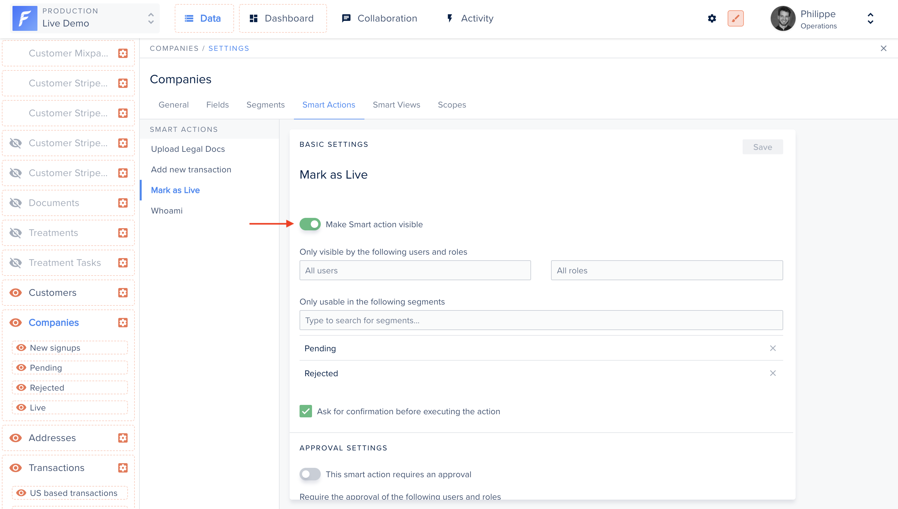
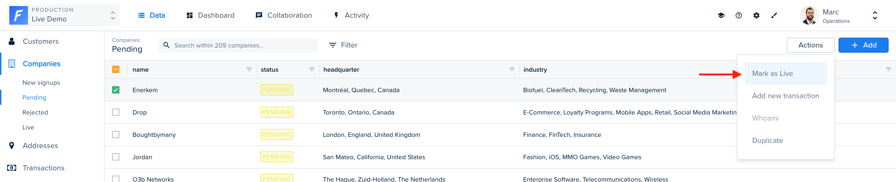

## What is an Action?

Sooner or later, you will need to perform actions on your data that are specific to your business. Moderating comments, generating an invoice, logging into a customer’s account or banning a user are exactly the kind of important tasks to unlock in order to manage your day-to-day operations.
On our Live Demo example, our companies collection has many examples of Action. The simplest one is Mark as live.

## Creating an Action

In order to create an action, you will first need to declare it in your code for a specific collection. Here we declare a Mark as Live Smart action for the companies collection.

```javascript
.collection('companies', companiesCollection =>
  companiesCollection.registerAction('Mark as live', {
    scope: ActionScope.Single,
    execute: async (context, responseBuilder) => {
      return responseBuilder.success(
        `Company is now live!`,
      );
    },
  })
);
```

After declaring it, your action will appear in the Smart actions tab within your collection settings.



An action is displayed in the UI only if:

- it is set as "visible" (see screenshot below)
  AND
- in non-development environments, the user's role must grant the "trigger" permission



You must make the action visible there if you wish users to be able to see it.



It will then show in the actions dropdown button:





At this point, the action does nothing, because no route in your Admin backend handles the API call yet.



The action behavior is implemented in the `execute` function.
In the following example, we've implemented the behavior for the Mark as live Action, which simply changes a company's status to live.

```javascript
.collection('companies', companiesCollection =>
  companiesCollection.registerAction('Mark as live', {
    scope: ActionScope.Single,
      execute: async (context, responseBuilder) => {
        await context.collection.update(context.filter, { status: 'live' });
        return responseBuilder.success('Company marked as live!');
      }
  })
);
```

## Customizing response

Action response can be configured to achieve different types of results.

### Default success notification

```javascript
return responseBuilder.success();
```


### Custom success notification

```javascript
return responseBuilder.success('Company is now live!');
```


### Custom error notification

```javascript
return responseBuilder.error('The company was already live!');
```


