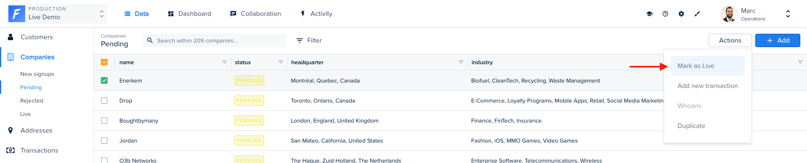
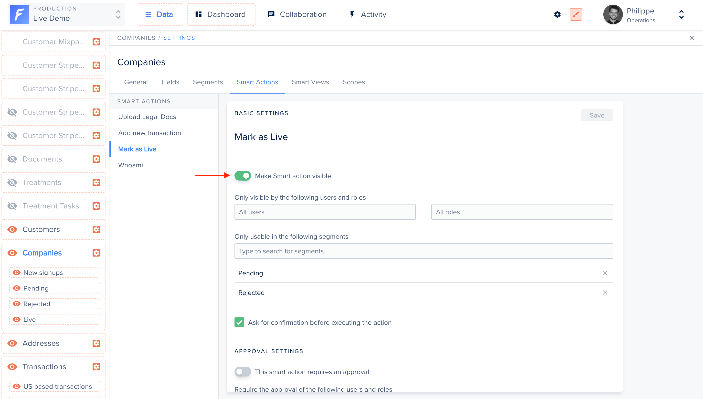

Sooner or later, you will need to perform actions on your data that are specific to your business. Moderating comments, generating invoices, logging into a customer’s account, or banning users are exactly the kind of important tasks to unlock to manage your day-to-day operations.



## In your code

To create an action, you will first need to declare it in your code for a specific collection. Here we declare a Mark as Live action for the `companies` collection.

The action behavior is implemented in the `execute()` function.

```javascript
agent.customizeCollection('companies', collection =>
  collection.addAction('Mark as live', {
    scope: 'Single',
    execute: async context => {
      // Perform work here.
    },
  }),
);
```

## In the admin panel

After declaring it, your action will appear in the "Smart actions" tab within your collection settings.



An action is displayed in the UI only if:

- it is set as "visible" (see screenshot below)
  AND
- in non-development environments, the user's role must grant the "trigger" permission



You must make the action visible there if you wish users to be able to see it.


