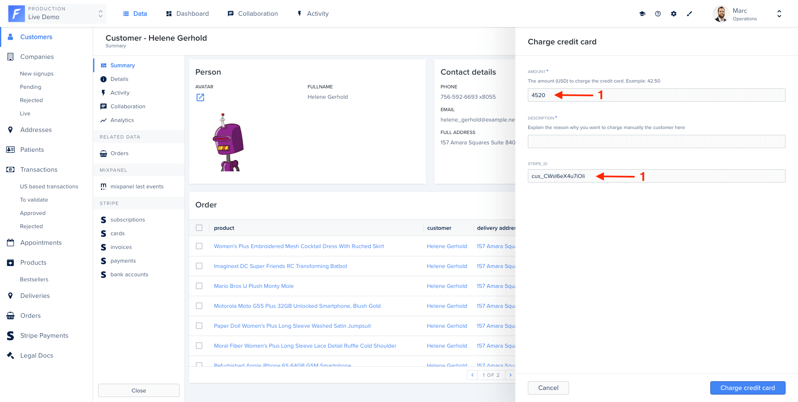

Very often, you will need to ask user inputs before triggering the logic behind an action.
For example, you might want to specify a reason if you want to block a user account. Or set the amount to charge a user’s credit card.

In the following example, an action form will be displayed for the "Charge credit card" action.

```javascript
collection.registerAction('Charge credit card', {
  scope: ActionScope.Bulk,
  form: [
    {
      label: 'Amount',
      description: 'The amount (USD) to charge the credit card. Example: 42.50',
      type: ActionFieldType.Number,
    },
    {
      label: 'description',
      description: 'Explain the reason why you want to charge manually the customer here',
      isRequired: true,
      type: ActionFieldType.String,
    },
    {
      label: 'stripe_id',
      isRequired: true,
      type: ActionFieldType.String,
    },
  ],
  execute: async (context, responseBuilder) => {
    try {
      // Add your business logic here
      return responseBuilder.success(`Amount charged!`);
    } catch (error) {
      return responseBuilder.error(`Failed to charge amount: ${error}`);
    }
  },
});
```



## Form entries

Here is the list of available options to customize the input form. More informations can be found on our API Reference

| name         | type                                     | description                                                                                                                                                     |
| ------------ | ---------------------------------------- | --------------------------------------------------------------------------------------------------------------------------------------------------------------- |
| label        | `String`                                 | Label of the input field                                                                                                                                        |
| type         | `String`                                 | The type of the field                                                                                                                                           |
| description  | `String`                                 | (optional) Add a description for your admin users to help them fill correctly your form                                                                         |
| isRequired   | `Boolean` or `ContextHandler`            | (optional) If true, your input field will be set as required in the browser. Default is false. `ContextHandler` provide an way to modify the value dynamically  |
| isReadOnly   | `Boolean` or `ContextHandler`            | (optional) If true, your input field will be set as read only in the browser. Default is false. `ContextHandler` provide an way to modify the value dynamically |
| if           | `ContextHandler`                         | (optional) Provide a way to change the visibility of the field dynamically                                                                                      |
| value        | `ContextHandler`                         | (optional) Provide a way to change the value of the field dynamically                                                                                           |
| defaultValue | Type matching `type` or `ContextHandler` | (optional) The default input value. `ContextHandler` provide an way to modify the default value dynamically                                                     |

## Typing system

Form entries are typed, and the available types are:

- Primitives: `Boolean`, `Date`, `Dateonly`, `Json`, `Number`, `String`
- Lists of primitives: `Number[]`, `String[]`
- Enums
- Files: `File` and `File[]` ()
- Links to records from other collections: `Collection`

Note that:

- When using `Enum` or `Enum[]`, your form entry must provide an additional `enumValues` key.
- When using `Collection`, your form entry must provide an additional `collectionName` key.

## Dynamic forms

Business logic often requires your forms to adapt to their context. Forest Admin makes this possible through a powerful way to extend your form's logic.
To make action form dynamic, you can use a `ContextHandler` instead of static value on the compatible properties.

`ContextHandler` let you interact with record or the form values to make your form dynamic.

### Interacting with selected records

When using action, you'll probably need te get the values or ids of the selected records. See below how this can be achieved.
Obviously this feature is only available for `Single` or `Bulk` action.

To do that, you just need to use the `context` provided object to `ContextHandler` you can defined on each compatible properties of the smart action.

 

```javascript
// Get the record with the wanted field
const record = await context.getRecord(['firstName']);

// Get id of selected record
const recordId = await context.getId();
```

 

```javascript
// Get records with the wanted field
const records = await context.getRecords(['firstName']);

// Get ids of selected records
const recordIds = await context.getIds();
```



### Interacting with form values

You will probably need to compute values based on the data entered by the user.

To do that, you can use the `context.formValues` object.

```javascript
// Get the value of "Amount" form field
const value = context.formValues['Amount'];
```

### Change your form's data based on previous field values

The following example takes advantage of a few `ContextHandler` properties:

```javascript
.registerAction('Tell me a greeting', {
  scope: ActionScope.Single,
  form: [
    {
      label: 'How should we refer to you?',
      type: ActionFieldType.Enum,
      if: async context => {
        const person = await context.getRecord(['firstName', 'fullName']);

        return Boolean(person.firstName || person.fullName);
      },
      enumValues: async context => {
        const person = await context.getRecord(['firstName', 'lastName', 'fullName']);

        return [
          person.firstName,
          person.fullName,
          `Mr. ${person.lastName}`,
          `Mrs. ${person.lastName}`,
          `Miss ${person.lastName}`,
        ];
      },
    },
  ],
  execute: async (context, responseBuilder) => {
    return responseBuilder.success(
      `Hello ${context.formValues['How should we refer to you?']}!`,
    );
  },
})

```

Here, the form field `How should we refer to you?` will only be displayed if the action was triggered on a record with either a `firstName` or `fullName`.
When displayed, a widget "Dropdown" will be displayed, and the only available values are returned in the `enumValues` function.
Finally, executing the action will display a notification based on the user choice.

### Add/remove fields dynamically

Use the `if` property of a field to allow you to hide or display it upon some logic.

```javascript
.registerAction('Leave a review', {
  scope: ActionScope.Single,
  form: [
    {
      label: 'Rating',
      type: ActionFieldType.Enum,
      enumValues: ['1', '2', '3', '4', '5'],
    },
    {
      label: 'Put a comment',
      type: ActionFieldType.String,
      if: context => Number(context.formValues.Rating) < 4,
    },
  ],
  execute: async (context, responseBuilder) => {
    // use context.formValues to save theses informations or trigger an event.
    return responseBuilder.success(`Thank you for your review!`);
  },
})
```
