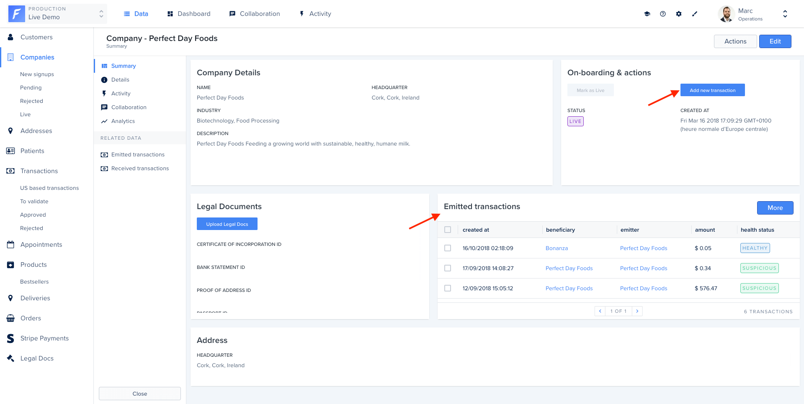
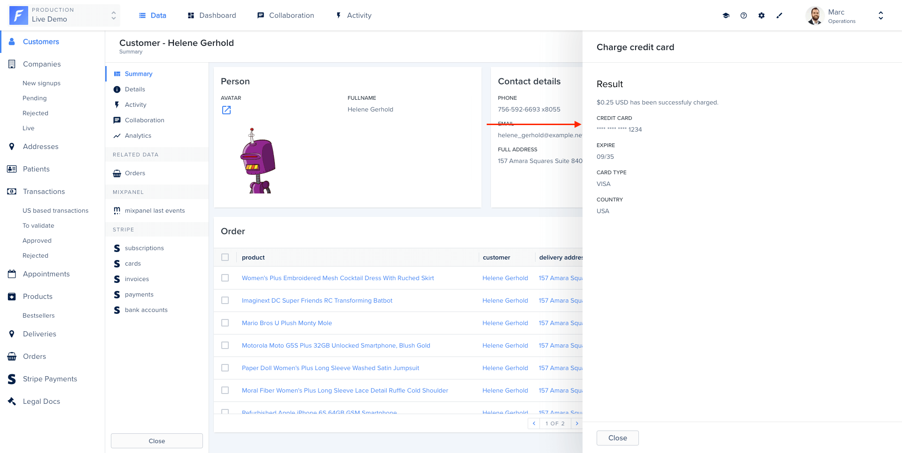

Aside from their actual behavior in the agent, actions can be configured to achieve different results in the frontend.

## Notifications

Most actions will simply perform work on the agent, and display a notification to the admin-panel user.

```javascript
return responseBuilder.success();
```


```javascript
return responseBuilder.success('Company is now live!');
```


```javascript
return responseBuilder.error('The company was already live!');
```


### Refreshing data on the summary view

If you want to create an action accessible from the details or the summary view of a record involving related data, this section may interest you.

In the example below, the “Add new transaction” action is accessible from the summary view. This action creates a new transaction and automatically refresh the “Emitted transactions” related data section to see the new transaction.



```javascript
return responseBuilder.success('New transaction emitted', {
  type: 'text',
  invalidated: ['emitted_transactions'],
});
```

## HTML panel

You can also return a HTML page as a response to give more feedback to the user who triggered your Action.

For instance:

```javascript
const record = await context.getRecord();
return responseBuilder.success(
  `
    <p class="c-clr-1-4 l-mt l-mb">\$${record.amount / 100} USD has been successfuly charged.</p>
    <strong class="c-form__label--read c-clr-1-2">Credit card</strong>
    <p class="c-clr-1-4 l-mb">**** **** **** ${record.source.last4}</p>
  `,
  { type: 'html' },
);
```



## File generation

On our Live Demo, the collection customers has an action Generate invoice. In this use case, we want to download the generated PDF invoice after clicking on the action. To indicate an action returns something to download, you have to enable the option `generateFile`.

The example code below will trigger a file download (With the file named `filename.txt`, containing `StringThatWillBeInTheFile` using `text/plain` mimetype).

```javascript
collection.registerAction('Download a file', {
  scope: ActionScope.Global,
  generateFile: true,
  execute: async (context, responseBuilder) => {
    return responseBuilder.file('StringThatWillBeInTheFile', 'filename.txt', 'text/plain');
  },
});
```

## Redirections

To streamline your operation workflow, it could make sense to redirect to another page after a Smart action was successfully executed.

It is possible using the `redirectTo` function.

The redirection works both for internal (\*.forestadmin.com pages) and external links.

 

```javascript
return responseBuilder.redirectTo(
  '/MyProject/MyEnvironment/MyTeam/data/20/index/record/20/108/activity',
);
```

 

```javascript
return responseBuilder.redirectTo(
  'https://www.royalmail.com/portal/rm/track?trackNumber=ZW924750388GB',
);
```



## Webhooks

After an action you can set up a HTTP (or HTTPS) callback - a webhook - to forward information to other applications.

```javascript
return responseBuilder.webhook(
  'http://my-company-name', // The url of the company providing the service.
  'POST', // The method you would like to use (typically a POST).
  {}, // You can add some headers if needed.
  { adminToken: 'your-admin-token' }, // A body to send to the url (only JSON supported).
);
```
