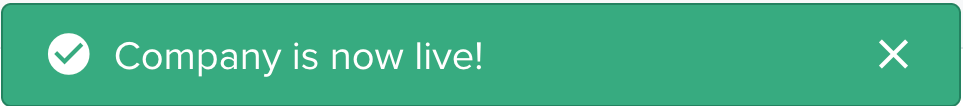

Aside from their actual behavior in the agent, actions can be configured to achieve different results in the GUI.

Most actions will simply perform work and display the default notification, however, other behaviors are possible:
- [Displaying a notification with a custom message](#custom-notifications)
- [Displaying HTML content in a side panel](#html-response)
- [Generating a file download](#file-generation)
- [Redirecting the user to another page](#redirections)
- [Calling a webhook from the user's browser](#webhooks) (for instance to trigger a login in a third-party application)

## Default behavior

The default behavior, when no exception is thrown in the handler is to display a generic notification.


```javascript
agent.customizeCollection('companies', collection =>
  collection.addAction('Mark as live', {
    scope: 'Single',
    execute: async (context) => {
      // Doing nothing will trigger the default success notification.
    },
  }),
);
```

## Custom notifications

When customizing the notification message, you can use the `resultBuilder` to generate different types of responses.




```javascript
agent.customizeCollection('companies', collection =>
  collection.addAction('Mark as live', {
    scope: 'Single',
    execute: async (context) => {
      // The resultBuilder can be used to generate different types of responses.
      if (/* ... Company is not live ... */) {
        return resultBuilder.success('Company is now live!');
      } else {
        return resultBuilder.error('The company was already live!');
      }
    },
  }),
);
```

## HTML response

You can also return an HTML page as a response to give more feedback to the user who triggered your Action.


```javascript
agent.customizeCollection('companies', collection =>
  collection.addAction('Charge credit card', {
    scope: 'Single',
    execute: async (context) => {
      /* ... charge the credit card ... */

      if (/* ... the credit card was successfully charged ... */) {
        return resultBuilder.success('Success', {
          html: `
              <p class="c-clr-1-4 l-mt l-mb">\$${record.amount / 100} USD has been successfuly charged.</p>
              <strong class="c-form__label--read c-clr-1-2">Credit card</strong>
              <p class="c-clr-1-4 l-mb">**** **** **** ${record.source.last4}</p>
            `,
        });
      } else {
        return resultBuilder.error('An error occured', {
          html: `
              <p class="c-clr-1-4 l-mt l-mb">\$${record.amount / 100} USD has not been charged.</p>
              <strong class="c-form__label--read c-clr-1-2">Credit card</strong>
              <p class="c-clr-1-4 l-mb">**** **** **** ${record.source.last4}</p>
              <strong class="c-form__label--read c-clr-1-2">Reason</strong>
              <p class="c-clr-1-4 l-mb">You can not charge this credit card. The card is marked as blocked</p>
            `,
        });
      }
    },
  }),
);
```

## File generation

[On our Live Demo](https://app.forestadmin.com/livedemo), the collection `customers` has an action Generate invoice. In this use case, we want to download the generated PDF invoice after clicking on the action. To indicate that an action returns something to download, you have to enable the option `generateFile`.

The example code below will trigger a file download (With the file named `filename.txt`, containing `StringThatWillBeInTheFile` using `text/plain` mime-type).

```javascript
collection.addAction('Download a file', {
  scope: 'Global',
  generateFile: true,
  execute: async (context, resultBuilder) => {
    return resultBuilder.file('StringThatWillBeInTheFile', 'filename.txt', 'text/plain');
  },
});
```

## Redirections

To streamline your operation workflow, it could make sense to redirect to another page after an action was successfully executed.

It is possible using the `redirectTo` function.

The redirection works both for internal (`\*.forestadmin.com` pages) and external links.

 

```javascript
return resultBuilder.redirectTo(
  '/MyProject/MyEnvironment/MyTeam/data/20/index/record/20/108/activity',
);
```

 

```javascript
return resultBuilder.redirectTo(
  'https://www.royalmail.com/portal/rm/track?trackNumber=ZW924750388GB',
);
```

 

## Webhooks

After an action you can set up an HTTP (or HTTPS) callback - a webhook - to forward information to other applications.

```javascript
return resultBuilder.webhook(
  'http://my-company-name', // The url of the company providing the service.
  'POST', // The method you would like to use (typically a POST).
  {}, // You can add some headers if needed.
  { adminToken: 'your-admin-token' }, // A body to send to the url (only JSON supported).
);
```
