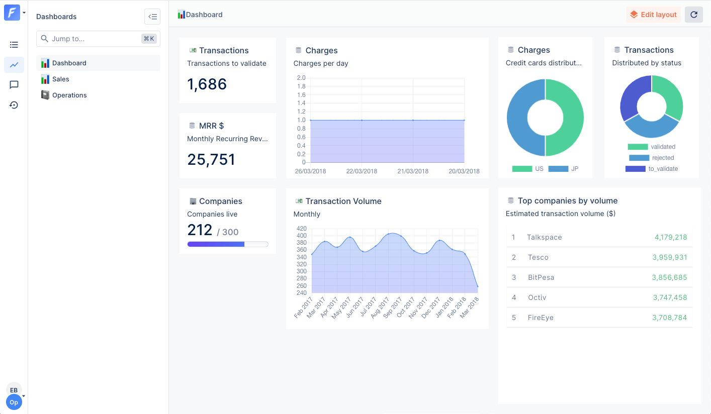
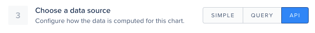
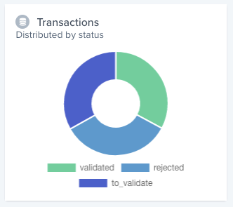
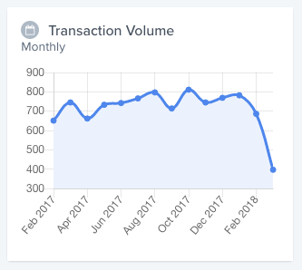
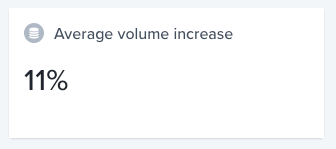
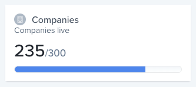
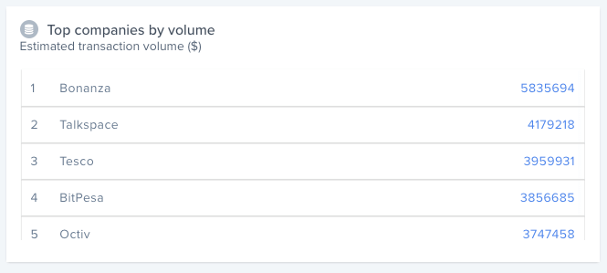

A well-known adage says, "a picture is worth a thousand words": charts help people better understand and remember information.

Forest Admin dashboards are meant to answer that need.



# From your admin panel

Charts can be configured from the interface, without the need to write any code.

This is documented in the [User Guide](https://docs.forestadmin.com/user-guide/dashboards/charts)

# From your agent

Sometimes, charts data are closely tied to your business. Forest Admin allows you to code how the data fueling any given chart is computed.

This is done in three steps:

- Implement the chart from the agent code.
- Create a new chart on a Dashboard, and choose "API" as the data source.
- Enter the URL of the chart you just created (`/forest/_charts/<chartName>`).



Note that, when defining a chart from your agent:

- The type of the chart defined in your agent must match your selection when adding it to a dashboard.
- The name of the chart must be URL-safe.

## Relation to smart charts

[Smart charts](../frontend-customization/smart-charts/README.md) is a forest admin feature which allow to implement types of charts which are not supported natively (density maps, cohorts, ...).

Coding a chart handler from your agent, in the other hand, give your freedom in how the data powering a native chart is computed.

## Examples


In the following list of examples, we are making queries using the [Forest Admin Query Interface](../under-the-hood/queries/README.md).

As Forest Admin does not impose any restriction on the handler, you are free to call external APIs, or query your database directly.


### Value chart


```javascript
agent.addChart('mrr', async (context, resultBuilder) => {
  // [...]

  return resultBuilder.value(25751);
});
```

### Distribution chart



Distribution charts should return a plain object.

```javascript
agent.addChart('booksByAuthorCountry', async (context, resultBuilder) => {
  // [...]

  return resultBuilder.distribution({
    validated: 100,
    rejected: 100,
    to_validate: 100,
  });
});
```

### Time-based



Time-based charts are very similar to distribution charts, the only differences being that:

- An additional parameter tells the frontend if the dates should be displayed by `Day`, `Week`, `Month` or `Year`.
- The keys of the provided object must be ISO-8601 compliant dates.

```javascript
agent.addChart('transactionVolume', async (context, resultBuilder) => {
  // [...]

  return resultBuilder.timeBased('Month', {
    '2017-02-01': 636,
    '2017-03-01': 740,
    '2017-04-01': 648,
    '2017-05-01': 726,
    // [...]
  });
});
```

### Percentage



Percentage charts are very similar to value charts.

```javascript
agent.addChart('averageVolumeIncrease', async (context, resultBuilder) => {
  // [...]

  return resultBuilder.percentage(11);
});
```

### Objective chart



Objective charts are very similar to value charts, the only difference being that two numbers should be provided to the `resultBuilder`.

```javascript
agent.addChart('companiesLive', async (context, resultBuilder) => {
  // [...]

  return resultBuilder.objective(235, 300);
});
```

### Leaderboard chart



Leaderboard chart display a list of records sorted by their value.

```javascript
agent.addChart('companiesLive', async (context, resultBuilder) => {
  // [...]

  return resultBuilder.leaderboard({
    Bonanza: 5835694,
    TalkSpace: 4179218,
    Tesco: 3959931,
    BitPesa: 3856685,
    Octiv: 3747458,
  });
});
```
