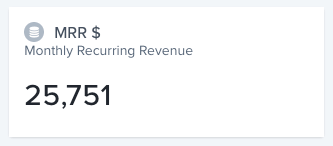
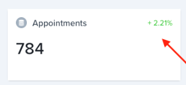

Value charts simply are charts that display a single value.

They can be added to the _Dashboard_ using the `addChart` method on the agent object

```javascript
// Add a chart to the Dashboard page
agent.addChart('monthlyRecuringRevenue', async (context, resultBuilder) => {
  // Request the sum of the "amount" field of all the records in the "payments" collection
  const aggregation = { operation: 'Sum', field: 'amount' };
  const filter = { conditionTree: { field: 'status', operator: 'equal', value: 'paid' } };
  const rows = await context.dataSource.getCollection('payments').aggregate(filter, aggregation);

  // Return the result to the chart
  return resultBuilder.value(rows[0].value);
});
```

Or to the _Analytics_ page of a collection using the `addChart` method on the collection object

```javascript
// Add a chart to the Analytics page of the collection "customers"
agent.customizeCollection('customers', collection => {
  collection.addChart('monthlyRecuringRevenue', async (context, resultBuilder) => {
    // Request the sum of the "amount" field of the records in the "payments" collection matching
    // current customer
    const aggregation = { operation: 'Sum', field: 'amount' };
    const filter = {
      conditionTree: {
        aggregator: 'And',
        conditions: [
          { field: 'status', operator: 'equal', value: 'paid' },
          { field: 'customer:id', operator: 'equal', value: context.recordId },
        ],
      },
    };
    const rows = await context.dataSource.getCollection('payments').aggregate(filter, aggregation);

    // Return the result to the chart
    return resultBuilder.value(rows[0].value);
  });
});
```

Optionally, an older value can be provided to the `resultBuilder` to display a growth percentage on the top right of the widget as in the following screenshot:



```javascript
agent.addChart('appointments', async (context, resultBuilder) => {
  // [...]

  return resultBuilder.value(784, 760);
});
```
