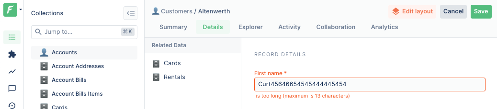

Most datasources are able to import validation rules from their target.
For instance, if you are using the [SQL Datasource](../../datasources/provided/databases/sql.md)

- Columns of type `VARCHAR(15)` will automatically carry a `less than 15 chars` validator.
- Non-nullable columns will automatically carry a `Present` validator.

However, you may want to enforce stricter restrictions than the ones which are implemented in your datasource.

## Adding validation rules

The list of operators (`Present`, `LongerThan`, ...) which can be used when adding validators is the same than the [filter operators](../../under-the-hood/queries/filters.md#operators).

```javascript
collection
  .addFieldValidation('firstName', 'Present')
  .addFieldValidation('firstName', 'LongerThan', 2)
  .addFieldValidation('firstName', 'ShorterThan', 13);
```

## Custom validators

If you need to implement custom validator, or validation over multiple fields you may use [change hooks](../hooks/README.md).
