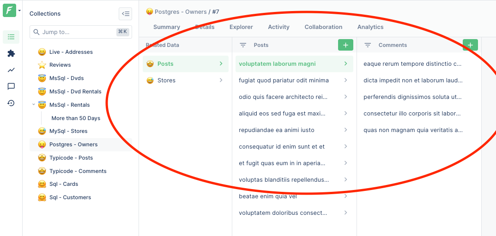

Relation that points to multiple records are displayed in the frontend in the `Related Data` and in the `Explorer` sections.



## One-to-Many relations

In a one-to-many relation, one record from a collection is connected to multiple record in another.

Think about countries and towns: a country have multiple towns, each towns belongs to a country.

```javascript
// Link 'countries' to 'towns'
agent.customizeCollection('countries', collection =>
  collection.addOneToManyRelation('myTowns', 'towns', {
      originKey: 'country_id',
      originKeyTarget: 'id', // Optional (uses primary key of countries by default)
    }
  }),
);
```

## Many-to-Many relations

In a many-to-many relation, three collections are used instead of two to build the relation.

This allows multiple records from one collection to be connected to multiple records from another.

For instance, in a movie recommendation website, each user can rate many movies, and each movie can be rated by many users.
The three collections which are being used are `users` (the origin collection), `ratings` (the "throught" collection) and `movies` (the "foreign" collection).

```javascript
// Create one side of the relation ...
agent.customizeCollection('users', collection => {
  collection.addManyToManyRelation('ratedMovies', 'movies', 'ratings', {
    originKey: 'user_id',
    foreignKey: 'movie_id',
  });
});

// ... and the other one
agent.customizeCollection('movies', collection => {
  collection.addManyToManyRelation('whoRatedThisMovie', 'users', 'ratings', {
    originKeyTarget: 'id', // Optional (uses primary key of movies by default)
    originKey: 'movie_id',
    foreignKey: 'user_id',
    foreignKeyTarget: 'id', // Optional (uses primary key of users by default)
  });
});
```

## External relations

External relations allow to define collection which will only be available through the "Related Data" section or a given model.

Note that external relation do not support pagination

```javascript
const states = [
  { code: 'AK', name: 'Alaska', zipMin: 99501, zipMax: 99950, closeTo: [] },
  { code: 'AL', name: 'Alabama', zipMin: 35004, zipMax: 36925, closeTo: ['TE', 'MI', 'GE', 'FL'] },
  { code: 'AR', name: 'Arkansas', zipMin: 71601, zipMax: 72959, closeTo: ['OK', 'TX', 'LO', 'MI'] },
  { code: 'AZ', name: 'Arizona', zipMin: 85001, zipMax: 86556, closeTo: ['NM', 'CO', 'UT', 'NE'] },
  { code: 'CA', name: 'California', zipMin: 90001, zipMax: 96162, closeTo: ['OR', 'NE', 'AZ'] },
  // ....
];

agent.customizeCollection('address', collection => {
  collection.addExternalRelation('nearStates', {
    // Define schema of the records in the relation.
    schema: { code: 'Number', name: 'String' },

    // Which fields are needed from the parent record to run the handler?
    // Dependencies are optional: by default only the primary key of address would be provided
    dependencies: ['country', 'zipCode'],
    getRecords: async ({ country, zipCode }) => {
      if (country === 'USA') {
        const state = states.find(s => s.zipMin < zipCode && zipCode < s.zipMax);
        return states.filter(s => state.closeTo.includes(s.code));
      }

      return [];
    },
  });
});
```
