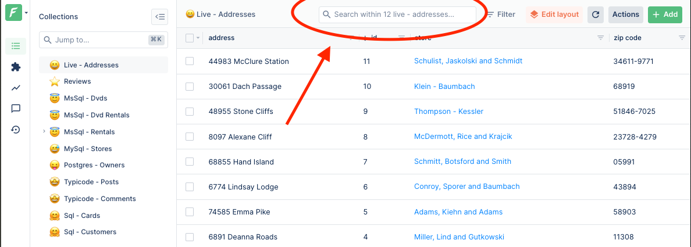
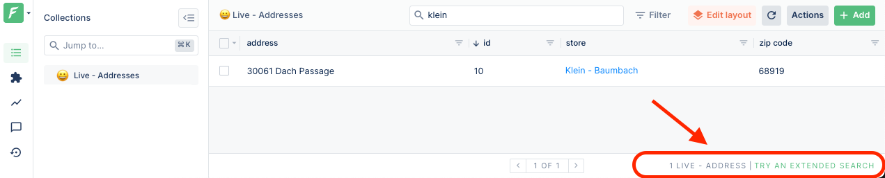

In Forest Admin, pages which show lists of records have a free-text search widget on top of them.



## Search modes

Two search modes are supported: normal and extended.

- All searchs start by being a "normal search".
- If the result the user is looking for is not found, it is possible to trigger an extended search from the user interface.



## Default behavior

When not defined otherwise by the [datasource](../datasources/README.md), the search behavior is to attempt to search within columns of the collection (in normal mode), or columns of the collection of direct relations (in extended mode).

By default, Forest Admin will search only on some columns, depending on their respective types.

| Column Type | Default search behavior                                                |
| ----------- | ---------------------------------------------------------------------- |
| Enum        | Column is equal to the search string (case-insensitive)                |
| Number      | Column is equal to the search string (if the search string is numeric) |
| String      | Column contains the search string (case-insensitive)                   |
| Uuid        | Column is equal to the search string                                   |
| Other types | Column is ignored by the default search handler                        |

## Customization

You may want to change how the search bar behaves in your admin-panel.

For instance:

- Search only on the columns which are relevant to your use-case.
- Use a full-text indexes of your data (i.e Postgres `tsquery` and `tsvector`, Algolia, Elastic search, ...)

In order to customize the search bar, you must define a handler which returns a [`ConditionTree`](../under-the-hood/queries/filters.md#condition-trees).

### Making the search case-insensitive

In this example, we use the `searchExtended` condition to toggle between case-sensitive and insensitive search.

```javascript
agent.customizeCollection('people', collection =>
  collection.replaceSearch((searchString, extendedMode) => {
    const operator = extendedModel ? 'Contains' : 'IContains';

    return {
      aggregator: 'Or',
      conditions: [
        { field: 'firstName', operator, value: searchString },
        { field: 'lastName', operator, value: searchString },
      ],
    };
  }),
);
```

### Changing searched columns

```javascript
const productReferenceRegexp = /^[a-f]{16}$/i;
const barCodeRegexp = /^[0-9]{10}$/i;

agent.customizeCollection('products', collection =>
  collection.replaceSearch(async (searchString, extendedMode, context) => {
    // User is searching using a product reference.
    if (productReferenceRegexp.test(searchString))
      return { field: 'reference', operator: 'Equal', value: searchString };

    // User is search a bar-code
    if (barCode.test(searchString))
      return { field: 'barCode', operator: 'Equal', value: Number(searchString) };

    // User is searching something else, in "normal mode", let's only search in the product name
    if (!extendedMode) return { field: 'name', operator: 'Contains', value: searchString };

    // In extended mode, we search on name, description and brand name
    return {
      aggregator: 'Or',
      conditions: [
        { field: 'name', operator: 'Contains', value: searchString },
        { field: 'description', operator: 'Contains', value: searchString },
        { field: 'brand:name', operator: 'Equal', value: searchString },
      ],
    };
  }),
);
```

### Calling an external API to implement search

If you data is indexed using a SaaS, external store or full-text index, you can call it in the search handler.

```javascript
const algoliasearch = require('algoliasearch');
const client = algoliasearch('undefined', 'undefined');
const index = client.initIndex('indexName');

agent.customizeCollection('products', collection =>
  collection.replaceSearch(async (searchString, extendedMode, context) => {
    const { hits } = index.search(searchString, {
      attributesToRetrieve: ['id'],
      hitsPerPage: 50,
    });

    return { field: 'id', operator: 'In', value: hits.map(h => h.id) };
  }),
);
```
