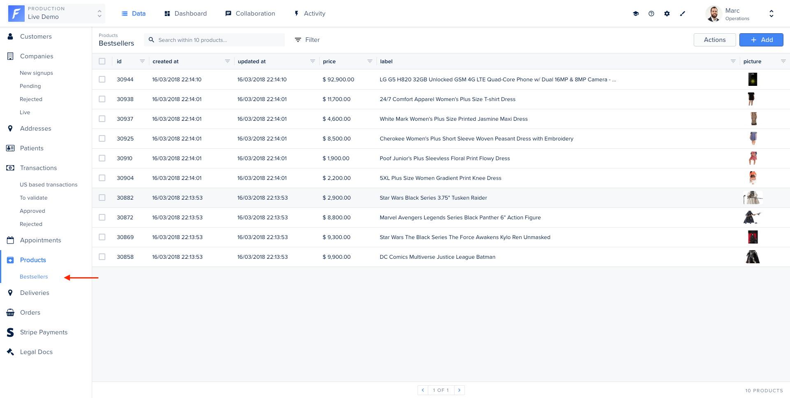

A **Segment** is a subset of a collection: it's basically a saved filter of your collection.

Segments are designed for those who want to _systematically_ visualize data according to specific sets of filters. It allows you to save your filters configuration so you don’t have to compute the same actions every day.



# From your admin panel

Segments can be configured from the interface, without the need to write any code.

This is documented in the [User Guide](https://docs.forestadmin.com/user-guide/collections/segments)

# From your agent

Sometimes, segment filters are complicated and closely tied to your business. Forest Admin allows you to code how the segment is computed.

For instance, on our Live Demo example, we’ve implemented a Segment on the collection `products` to allow admin users to see the bestsellers at a glance.

## Example


In the following example, we are making queries using the [Forest Admin Query Interface](../under-the-hood/queries/README.md).

As Forest Admin does not impose any restriction on the handler, you are free to call external APIs, or query your database directly instead.


The only requirement when implementing a segment from your agent is to return a valid `ConditionTree` (see [Understanding Filters](../under-the-hood/queries/filters.md)).

```javascript
agent.customizeCollection('products', collection =>
  collection.addSegment('mySegment', async context => {
    // Query the ids of the 10 most populate products by looking at the `orders` collection.
    const rows = await context.dataSource
      .getCollection('orders')
      .aggregate({}, { operation: 'Count', groups: [{ field: 'product_id' }] }, 10);

    // Return a condition tree which matches those records
    return { field: 'id', operator: 'in', value: rows.map(r => r['product_id']) };
  }),
);
```
