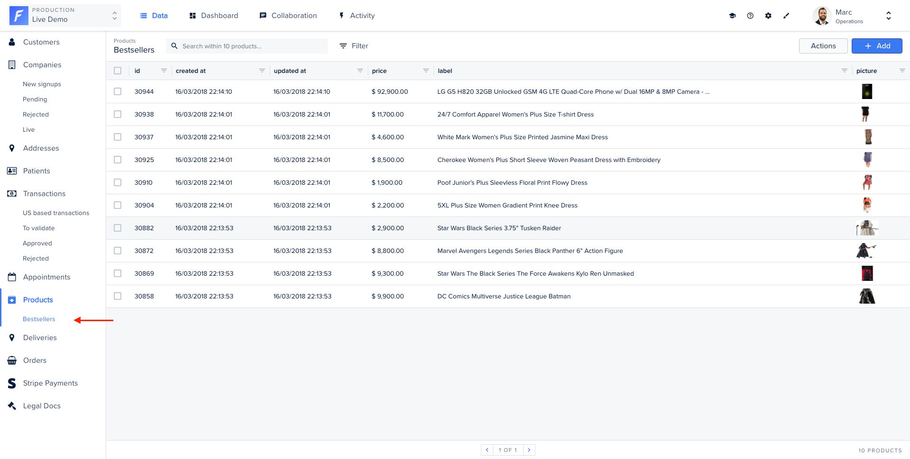

A **Segment** is a subset of a collection: it's basically a saved filter of your collection.

Segments are designed for those who want to _systematically_ visualize data according to specific sets of filters. It allows you to save your filters configuration so you don’t have to compute the same actions every day.



### From your admin panel

Segments can be configured from the interface, without the need to write any code.

This is documented in the [User Guide](https://docs.forestadmin.com/user-guide/collections/segments)

### From your agent

Sometimes, segment filters are complicated and closely tied to your business. Forest Admin allows you to code how the segment is computed.

On our Live Demo example, we’ve implemented a Segment on the collection `products` to allow admin users to see the bestsellers at a glance.

You’re free to implement the business logic you need. The only requirement is to return a valid `ConditionTree` (see [Understanding Filters](../connectors/custom/query-translation/filters.md)).

On this example, we use a raw SQL query to filter and sort the product that was sold the most.

```javascript
const SqlConnector = require('@forestadmin/datasource-sql');
const { Client } = require('pg');

// Connect to postgres
const client = new Client({ host: 'localhost', database: 'myDb', port: 5432 });
client.connect();

// Start agent
const agent = new Agent(options);

// Import collections from database
agent.importCollectionsFrom(new SqlConnector('postgres://localhost:5432/myDb'));

// Customize collection (we want to add a segment)
agent.customizeCollection('products', collection =>
  // Register segment using raw SQL query
  collection.registerSegment('Bestsellers', async context => {
    const { rows } = await client.query(`
      SELECT product_id, COUNT(*)
      FROM orders
      GROUP BY product_id
      ORDER BY count DESC
      LIMIT 10;
    `);

    return { field: 'id', operator: 'in', value: rows.map(r => r['product_id']) };
  }),
);
```
