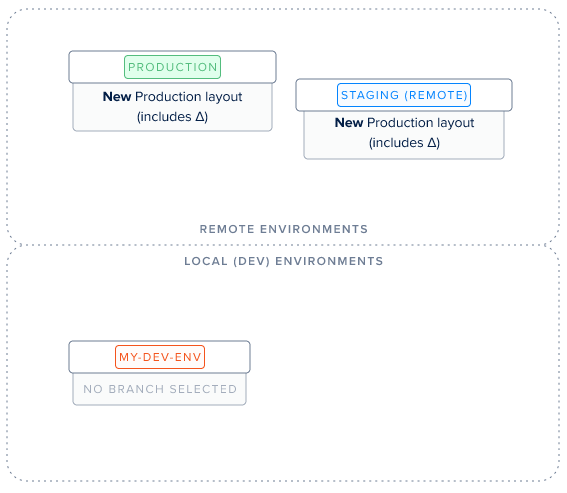
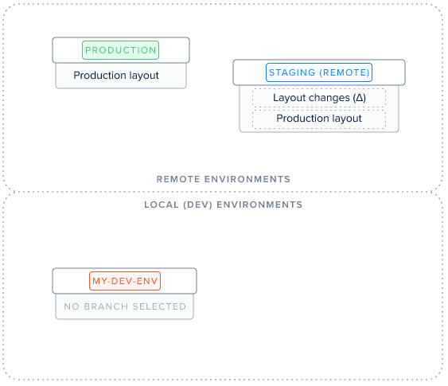
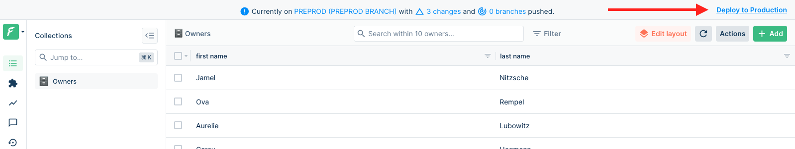

# Deploying your changes

You're building a great feature which requires tweaking your layout (UI), you've used the Layout Editor and it knows looks just like you had imagined? Well now is the time to try it on a remote server!

Imagine this is your current situation:


Your branch `my-branch` is based on your _production_ environment and you have made **layout changes (Δ)** over it.

### Applying your changes to production: `deploy`

**`deploy` ** means applying your branch's changes to your reference environment definitively. To achieve this, you'll be using Forest CLI's [deploy](forest-cli-commands/deploy.md) command from an environment have _production_ as origin:

```
forest deploy
```

The end result is the following:




Don't forget to **deploy your backend changes** as well (if any), as showcased on [this flowchart](./#development-workflow).



Note how your layout changes are also applied to your remote, as it is based on production.


### Testing your changes on a remote (i.e "staging"): `push`

**`push` ** means moving your branch's changes to a remote environment set as origin of your branch. To achieve this, you'll be using Forest CLI's [push](forest-cli-commands/push.md) command:

```
forest push
```


Note that you'll be pushing your **current** branch. To select another branch, use [switch](forest-cli-commands/switch.md).
If the origin of your branch is not the remote you want (ie: staging) change it with [set-origin](forest-cli-commands/set-origin.md)




#### Deploying from your remote's interface

Once you have tested your new feature on "Remote 1", you can't deploy your branch's layout to "Production", since your branch will have been deleted by pushing it to "Remote 1".

To deploy it from there, simply **click on "Deploy to production" in the top banner**!



#### Making changes directly from the remote

Imagine you've pushed your branch onto your remote, but notice a slight change is still required in the layout. Then, simply use the Layout Editor from your remote! It'll play nicely with your branch's layout changes: any changes you make on your remote will also be deployed when you run `forest deploy`.

You can also create a new branch with your remote environment as origin and do the same process explained above.
