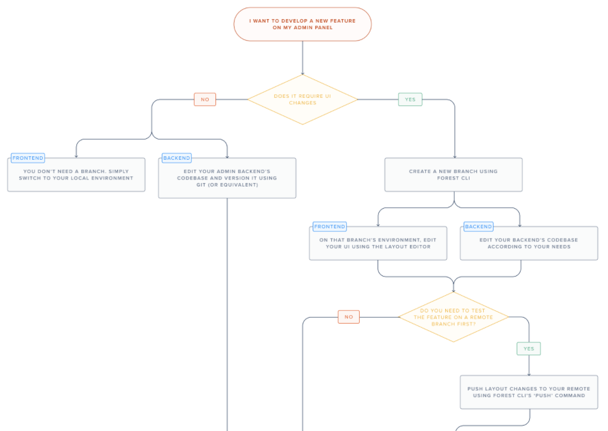
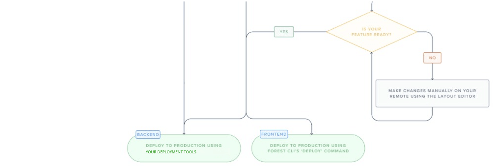

# Developing on Forest Admin

One of the goals of Forest Admin is empowering technical teams to achieve more in less time: in other words, giving them the means to create and maintain a great admin panel in as little time as possible.


If you created your project before May 10th, 2021 and want to benefit from this feature, please contact Forest Admin support to ask for it to be **"ready to migrate"**.


### Development tools

Your Forest Admin panel is composed of 2 parts - [the frontend (UI) and the backend](../) - and for each one you need the right tools:

The **Admin** **backend** is part of your codebase. As a result, you'll be using your own favorite tools to customize it:

- Editing: your favorite IDE
- Versioning: your favorite versioning tool (git, svn, mercurial, etc)

Your **Forest Admin UI** is **not** part of your codebase: it is managed on Forest Admin servers. As a result, you depend on Forest Admin tools to customize it. Here's what we've built for you:

- Editing: use the [Layout Editor mode](https://docs.forestadmin.com/user-guide/getting-started/master-your-ui/using-the-layout-editor-mode) to intuitively manage your layout (UI)
- Versioning: use [Forest CLI](forest-cli-commands/) to seamlessly manage your layout versions

### Development workflow

For a simple and hands-on **example** of how to develop on Forest Admin according to our recommended development workflow, see [this page](./development-workflow.md).

For a more complete view showcasing each possible scenario of the recommended development workflow, we've drawn the following state **diagram**:

In the next pages, we'll cover each step in details.
