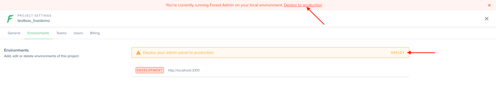
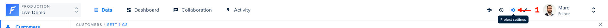
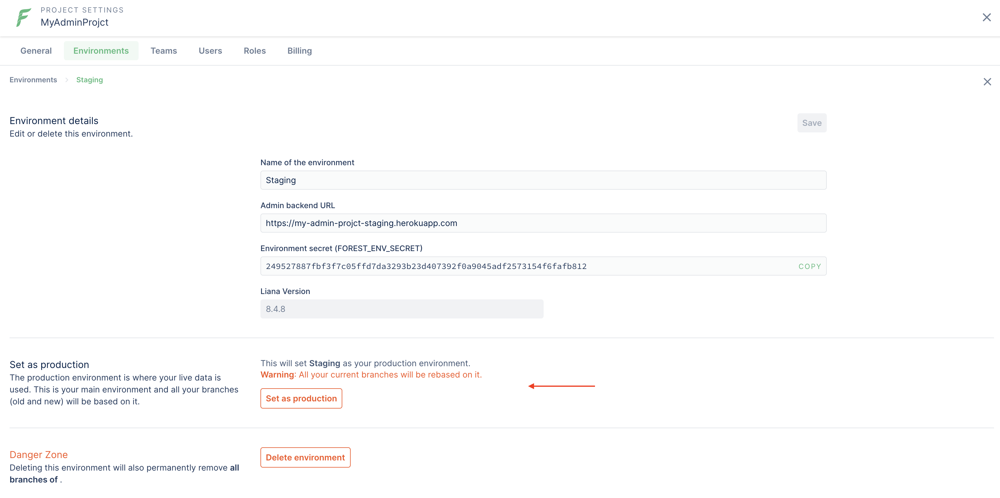

# Environments

After you install for the first time, a local **development** environment is created for you, with a temporary `pre-deploy-to-production` branch (more on _branches_ later).&#x20;

Your first objective should be to deploy to **production**.

### Deploying to Production

Forest Admin is meant to help you manage your operations: this can only happen if you work with your Production data! To do so, you need to **create your Production environment**.

Click "Deploy to production" on the top banner or in the _Environments_ tab of your Project settings.

#### Deploy your agent

On the first step, you need to input your agent's URL. This is the URL of the server onto which you have deployed (or will soon deploy) your agent's code base:


If you need help deploying your agent's codebase, here are 2 step-by-step guides showing how it can be done [on Heroku](../../how-tos/setup/deploy-to-production-on-heroku.md) or [on a standard ubuntu server](../../how-tos/setup/deploy-to-production-to-ubuntu-server.md).


.png>)


Note that for **security reasons**, your agent must use the **HTTPS** protocol.



The URL must not end with a trailing `/`.


#### Connect to your database

On the next step, you need to fill out your Production database credentials:

.png>)


Your **database credentials** never leave your browser and are solely used to generate environment variables on the next step, so they are **never exposed**.


#### Set your environment variables

The final step requires that you add environment variables to your server. Follow on-screen instructions:

.png>)

Once your node server is successfully detected and running with the indicated environment variables, a "Finish" button will appear. Click on it to finalize the creation of your Production environment.

### Creating a remote environment

Now that your admin panel is live in production, you might want to add an extra step for testing purposes. Forest Admin allows you to create remote (a.k.a **staging**) environments.

To create a new remote environment, go to your Project settings **(1)**:

Then from the _Environments_ tab, click on "Add a new environment" **(2)**.

.png>)


You can choose to deploy to a remote (staging) environment **before** going to production (see below), it's up to you.


.png>)

#### Choose your environment name

You'll first be asked to input the name of the remote environment you wish to create:

.png>)

#### Enter your agent's URL for that environment

Deploy your agent to your new server - your staging server for instance - then input its URL:

.png>)

#### Connect to your database

You need a separate database for this new environment: if you're creating a _Staging_, then it must be your _staging_ data, so your _staging_ database!

.png>)


Your **database credentials** never leave your browser and are solely used to generate environment variables on the next step, so they are **never exposed**.


#### Set your environment variables

The final step requires that you add environment variables to your server. Follow on-screen instructions:

.png>)

Once your node server is successfully detected and running with the indicated environment variables, a **Finish** button will appear. Click on it to finalize the creation of your new remote environment.

### Set an environment as production

A standard project usually has a production and at least a staging environment, but you may be using other remote enviroments. At some point you may feel the need to set another environment as your main environment (a.k.a production).

To do so, click on the enviroment you wish to set as production and from its details page, click"Set as production".


All your branches will be rebased on your new production. Any layout change that is not applicable will be ignored.


### Delete an environment

You may also delete an environment. **Be very careful** as there is no going back!
