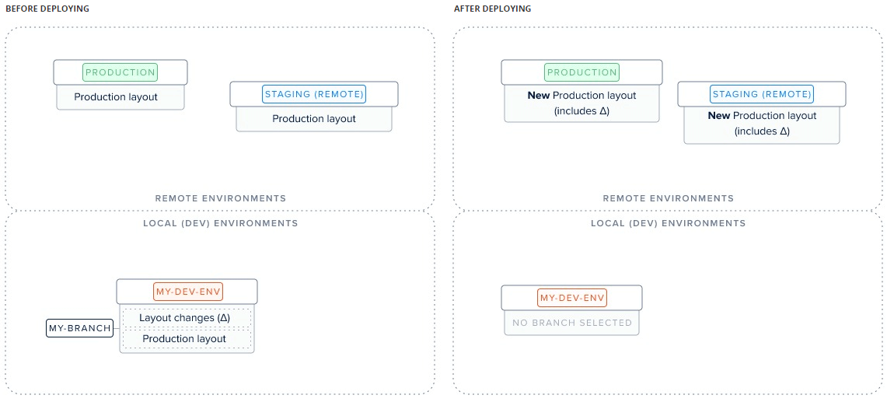
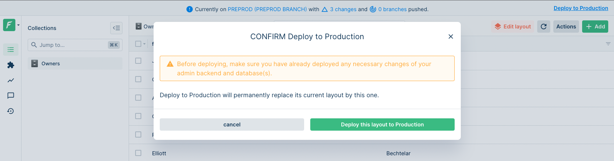

# deploy

The `forest deploy` command enables you to apply some layout changes to your [origin](../using-branches.md#what-is-a-branch) environment.

```
$ forest deploy --help

Deploy layout changes of a branch|staging to Production.

USAGE
  forest deploy [ENVIRONMENT_NAME]

ARGUMENTS
  ENVIRONMENT_NAME                 The name of the environment containing the layout changes to deploy to production.

OPTIONS
  --force                  Skip confirmations.
  --help                   Display usage information.
```

### Deploying your changes

It is paramount to understand this command before using it:



As you can see in the above figure, the layout changes (Δ) located in your local branch `my-branch` will be **irreversibly applied** to your Production layout. Since your remotes' layout are based on your production's layout, the changes will appear there too.

To deploy, simply run `forest deploy`:

```
$ forest deploy
? Select the environment containing the layout changes you want to deploy to production (Use arrow keys)
❯ Development | marcperrin-pelletier
Staging 1
Staging 2
```

### Deploy from the UI

This is possible **only from a remote** environment:



To deploy your latest layout changes from a remote environment, you may use the **top banner link**: "Deploy to production".
