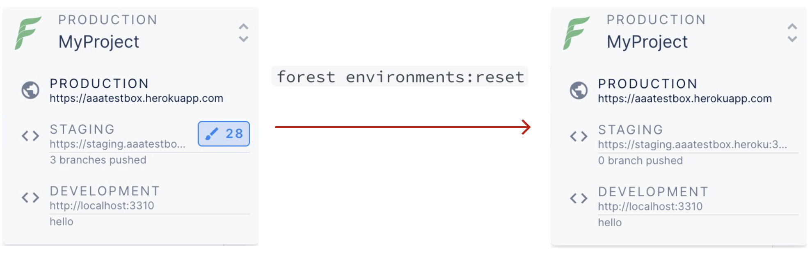

# environments:reset

The `forest environments` command is very useful as it allows you to manage your environments. But the sub command that we're more specifically interested in when it comes to developing on Forest Admin is:

```
$ forest environments:reset --help
Reset a remote environment by removing all layout changes

USAGE
  $ forest environments:reset

OPTIONS
  -e, --environment=environment  The remote environment name to reset.
  -p, --projectId=projectId      The id of the project to work on.
  --force                        Skip reset changes confirmation.
```

As you've learnt in [previous pages](push.md), the `forest push` command lets you push changes made in the layout to a remote environments and later `deploy` them to your production.

Sometimes though, there comes a time when you've stacked too many layout changes on a remote environment and just want to get rid of them.&#x20;

Unlike a branch which you can just dispose of, for a remote environment you need a way to clean it easily, this is where the `forest environments:reset` command comes in.


