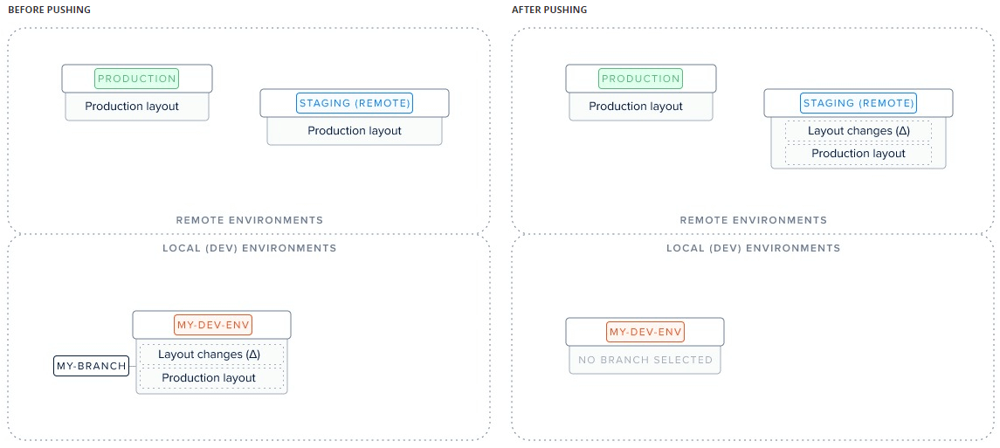
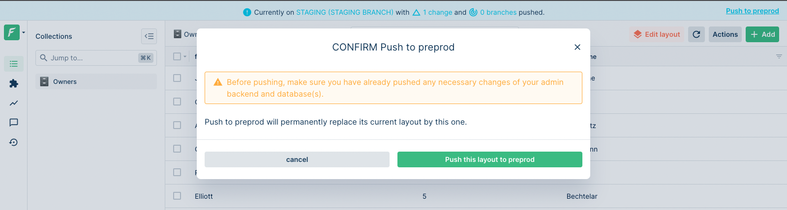

# push

The `forest push` command enables you to apply your local changes to a remote **non-reference** environment: for instance, pushing to your staging environment will result in your latest local layout changes being visible on your staging.

```
$ forest push --help
Push layout changes of your current branch to the branch origin.

USAGE
  $ forest push

OPTIONS
  --projectId=projectId          The id of the project to work on.
  --force                        Skip push changes confirmation.
  --help                         Display usage information.
```

### Pushing to a remote environment

It is paramount to understand this command before using it:



Pushing a branch to a remote means applying your latest layout changes to your origin environment. In the above figure, your layout changes (Δ) will be moved from `my-branch` to `Staging`.


Pushing your changes from your local branch will automatically **delete** it.


To push layout changes to your origin:

```
$ forest push
```

You will be prompted for confirmation before pushing to a remote:

```
$ forest push
[? Push branch my-current-branch onto Remote2 (Y|n): Y
```


To skip that confirmation, use the `--force` option.


### Push from the UI

This is possible **only from a remote** which `not` have the reference environment as origin:



To push your latest layout changes from a remote environment, you may use the **top banner link**: "Push to ...".

### Difference between forest push and forest deploy


Don't confuse `forest push` and `forest deploy`


- `forest push` applies the latest layout changes of that branch or environment to a non-reference environment
- `forest deploy` applies your latest layout changes **definitively** to your reference environment (i.e production)


You cannot `push` to production, because anything added on Production should be definitive. Therefore you can only `deploy` to Production.

