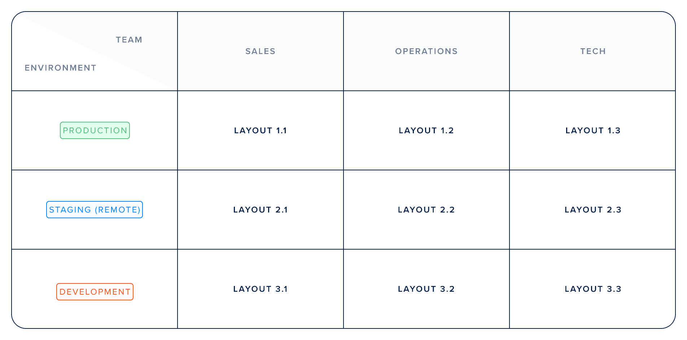
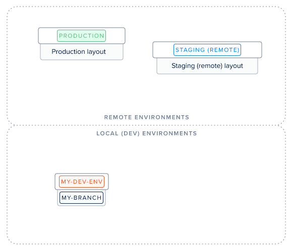
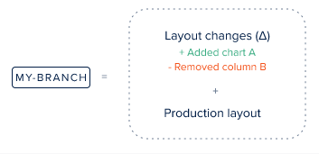
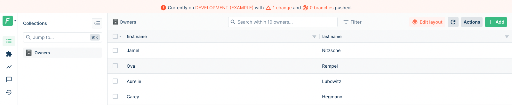

# Using branches

As we've explained in the previous page, your Admin panel's frontend is saved on Forest Admin servers. As a result, you can't version it. But don't worry, we've got you covered with some great tools!

### What is a layout?

The notion of a branch cannot be explained without first explaining what a _layout_ is.

A **layout** is all the settings that **define your user interface (UI)**. In Forest Admin, there is 1 layout per environment and per team:




To manipulate your layouts, you will be using [Forest CLI](forest-cli-commands/).


### What is a branch?

A branch is a fork (i.e copy) of the layout of its _origin_ environment. It is attached to your development environment.


The **origin** of a branch is either specified using the `--origin` option or selected when prompted otherwise). You should choose the environment you want to make some layout changes on.


Once you've created a branch, your layout will look exactly like the layout of its origin environment.

### How do branches work?

Any **layout change** you make on your current branch using the [Layout Editor](https://docs.forestadmin.com/user-guide/getting-started/master-your-ui/using-the-layout-editor-mode) will be **saved on your current branch** and will not affect its origin environment.

Imagine the following situation where you have 3 environments:



The branch `my-branch` is based on the production layout. Any changes made to it are saved in your branch's layout and can later be [applied](forest-cli-commands/deploy.md) to it.




This also means that any changes made to the origin of your branch will instantly reflect on your branch.

For those familiar with git's _rebase_, this means you will **never have to** **rebase** your branch on its origin.


### How do you create a branch?

To create a branch, you'll need to use [Forest CLI](forest-cli-commands/). Make sure you've created your local development environment using the [init](forest-cli-commands/init.md) command. Then, to create a branch named `my-branch` based on your `production` environment, simply run:

```
forest branch my-branch --origin production
```


Using kebab-case is recommended; however, should you want to use spaces in your branch name, don't forget to surround it with quotes, like so `forest branch "my branch" --origin ...`.


To learn more about the `branch` command, please visit [this page](forest-cli-commands/branch.md).

### Checking your branch information

On your interface, you can check at all times what branch you are on and how many layout changes were made: they appear in the top banner. The `X branches pushed` information is relevant for remote environments only: it shows how many branches were already pushed onto it.



Your **current** branch will be displayed at the top.


To switch your _current_ branch to another existing branch, check out the [switch](forest-cli-commands/switch.md) command.


Now that you've mastered branch creation and management, let's dive into the next step of the development workflow: deployment.
