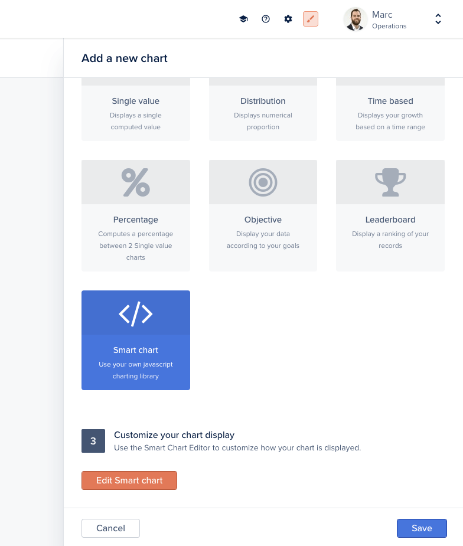
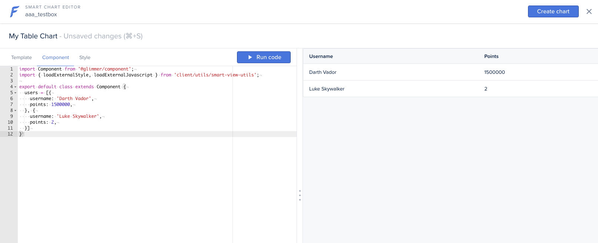

# Create a Smart Chart

By using the finite list of predefined charts (Single, Distribution, Time-based, etc.), you are constrained by how that data is displayed.

With **Smart Charts**, you can code exactly which data you want and how you want it displayed!


You need a **Starter plan** or above to create Smart charts


### Creating a Smart Chart 

To create a chart and access the _Smart Chart Editor_, click on the **Edit Smart Chart** button:

Next, use the _Template_, _Component,_ and _Style_ tabs to create your customized chart. At any point, you can render your chart by clicking on the **Run code** button.


Don't forget to click on **Create Chart** (or **Save** if the chart is already created) once you're done!



If you are creating a **record-specific** smart chart (in the record Analytics tab), the **`record`** object is directly accessible (either through `this.args.record` in the component or `@record` in the template).

