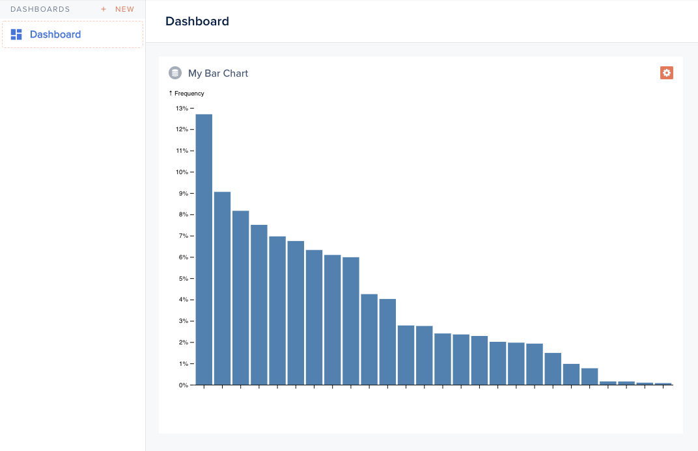

This second example shows how you can achieve any format of charts, as you can benefit from external libraries like D3js.



```handlebars
<div class='c-smart-view'>{{this.chart}}</div>
```





```javascript
import Component from '@glimmer/component';
import { loadExternalStyle, loadExternalJavascript } from 'client/utils/smart-view-utils';
import { action } from '@ember/object';
import { tracked } from '@glimmer/tracking';

export default class extends Component {
  constructor(...args) {
    super(...args);

    this.loadPlugin();
  }

  @tracked chart;
  @tracked loaded = false;

  async loadPlugin() {
    await loadExternalJavascript('https://d3js.org/d3.v6.min.js');

    this.loaded = true;
    this.renderChart();
  }

  async fetchData() {
    const response = await this.lianaServerFetch.fetch('/forest/custom-data', {});
    const data = await response.json();
    return data;
  }

  @action
  async renderChart() {
    if (!this.loaded) {
      return;
    }

    const color = 'steelblue';

    // Don't comment the lines below if you want to fetch data from your Forest server
    // const usersData = await this.fetchData()
    // const data = Object.assign(usersData.sort((a, b) => d3.descending(a.points, b.points)), {format: "%", y: "↑ Frequency"})

    // To remove if you're using data from your Forest server
    const alphabet = await d3.csv(
      'https://static.observableusercontent.com/files/09f63bb9ff086fef80717e2ea8c974f918a996d2bfa3d8773d3ae12753942c002d0dfab833d7bee1e0c9cd358cd3578c1cd0f9435595e76901508adc3964bbdc?response-content-disposition=attachment%3Bfilename*%3DUTF-8%27%27alphabet.csv',
      function (d) {
        return {
          name: d.letter,
          value: +d.frequency,
        };
      },
    );
    const data = Object.assign(
      alphabet.sort((a, b) => d3.descending(a.value, b.value)),
      { format: '%', y: '↑ Frequency' },
    );

    const height = 500;
    const width = 800;
    const margin = { top: 30, right: 0, bottom: 30, left: 40 };

    const x = d3
      .scaleBand()
      .domain(d3.range(data.length))
      .range([margin.left, width - margin.right])
      .padding(0.1);
    const y = d3
      .scaleLinear()
      .domain([0, d3.max(data, d => d.value)])
      .nice()
      .range([height - margin.bottom, margin.top]);

    const xAxis = g =>
      g.attr('transform', `translate(0,${height - margin.bottom})`).call(
        d3
          .axisBottom(x)
          .tickFormat(i => data[i].username)
          .tickSizeOuter(0),
      );

    const yAxis = g =>
      g
        .attr('transform', `translate(${margin.left},0)`)
        .call(d3.axisLeft(y).ticks(null, data.format))
        .call(g => g.select('.domain').remove())
        .call(g =>
          g
            .append('text')
            .attr('x', -margin.left)
            .attr('y', 10)
            .attr('fill', 'currentColor')
            .attr('text-anchor', 'start')
            .text(data.y),
        );

    const svg = d3.create('svg').attr('viewBox', [0, 0, width, height]);

    svg
      .append('g')
      .attr('fill', color)
      .selectAll('rect')
      .data(data)
      .join('rect')
      .attr('x', (d, i) => x(i))
      .attr('y', d => y(d.value))
      .attr('height', d => y(0) - y(d.value))
      .attr('width', x.bandwidth());

    svg.append('g').call(xAxis);

    svg.append('g').call(yAxis);

    this.chart = svg.node();
  }
}
```



In the above snippet, notice how we import the **D3js** library. Of course, you can choose to use any other library of your choice.


This bar chart is inspired by [this one](https://observablehq.com/@d3/bar-chart).


The resulting chart can be resized to fit your use.
