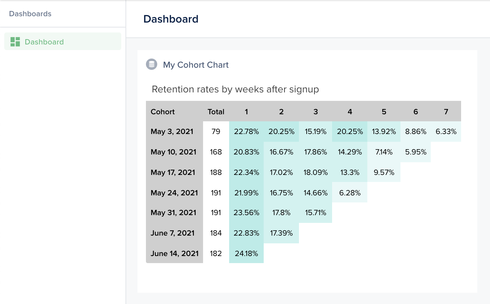

This is another example to help you build a Cohort Chart.

In the snippet, notice how we import the **D3js** library. Of course, you can choose to use any other library of your choice.

The resulting chart can be resized to fit your use.

 

```javascript
agent.addChart('cohort', async (context, resultBuilder) => {
  // You may want to load that data dynamically
  // [...]

  return resultBuilder.smart({
    title: 'Retention rates by weeks after signup',
    head: ['Cohort', 'New users', '1', '2', '3', '4', '5', '6', '7'],
    data: {
      'May 3, 2021': [79, 18, 16, 12, 16, 11, 7, 5],
      'May 10, 2021': [168, 35, 28, 30, 24, 12, 10],
      'May 17, 2021': [188, 42, 32, 34, 25, 18],
      'May 24, 2021': [191, 42, 32, 28, 12],
      'May 31, 2021': [191, 45, 34, 30],
      'June 7, 2021': [184, 42, 32],
      'June 14, 2021': [182, 44],
    },
  });
});
```

 

```javascript
import { action } from '@ember/object';
import { loadExternalJavascript } from 'client/utils/smart-view-utils';
import { inject as service } from '@ember/service';
import Component from '@glimmer/component';

export default class extends Component {
  @service lianaServerFetch;

  constructor(...args) {
    super(...args);
    this.load();
  }

  async load() {
    // Load charting library
    await loadExternalJavascript('https://d3js.org/d3.v6.min.js');

    // Load data from agent
    const response = await this.lianaServerFetch.fetch('/forest/_charts/cohort', {});
    const options = await response.json();
    const rows = this._buildRows(options.data);

    // Render chart
    this.renderChart(options.title, options.head, rows);
  }

  @action
  async renderChart(title, head, rows) {
    // Retrieve container
    const container = d3.select('#demo').append('div').attr('class', 'box');

    // Header
    container
      .append('div')
      .attr('class', 'box-header with-border')
      .append('p')
      .attr('class', 'box-title')
      .text(title || 'Retention Graph');

    const body = container.append('div').attr('class', 'box-body');
    const table = body.append('table').attr('class', 'table table-bordered text-center');

    table
      .append('thead')
      .append('tr')
      .attr('class', 'retention-thead')
      .selectAll('td')
      .data(head)
      .enter()
      .append('td')
      .attr('class', (d, i) => (i == 0 ? 'retention-date' : 'days'))
      .text(d => d);

    table
      .append('tbody')
      .selectAll('tr')
      .data(rows)
      .enter()
      .append('tr')
      .selectAll('td')
      .data(row => row)
      .enter()
      .append('td')
      .attr('class', (d, i) => (i == 0 ? 'retention-date' : 'days'))
      .attr('style', (d, i) =>
        i > 1 ? `background-color :${this._shadeColor('#00c4b4', d)}` : null,
      )
      .append('div')
      .attr('data-toggle', 'tooltip')
      .text((d, i) => d + (i > 1 ? '%' : ''));
  }

  _buildRows(data) {
    const rows = [];
    Object.entries(data).forEach(([date, days]) => {
      const percentDays = [date];

      for (let i = 0; i < days.length; i++)
        percentDays.push(i > 0 ? Math.round((days[i] / days[0]) * 100 * 100) / 100 : days[i]);

      rows.push(percentDays);
    });

    return rows;
  }

  _shadeColor(color, percent) {
    color = this._isValidHex(color) ? color : '#3f83a3'; // handle null color
    percent = 1.0 - Math.ceil(percent / 10) / 10;

    const f = parseInt(color.slice(1), 16);
    const t = percent < 0 ? 0 : 255;
    const p = percent < 0 ? percent * -1 : percent;
    const R = f >> 16;
    const G = (f >> 8) & 0x00ff;
    const B = f & 0x0000ff;

    const rgb =
      0x1000000 +
      (Math.round((t - R) * p) + R) * 0x10000 +
      (Math.round((t - G) * p) + G) * 0x100 +
      (Math.round((t - B) * p) + B);

    return `#${rgb.toString(16).slice(1)}`;
  }

  _isValidHex(color) {
    return /(^#[0-9A-F]{6}$)|(^#[0-9A-F]{3}$)/i.test(color);
  }
}
```

 

```handlebars
<div class='c-smart-chart'>
  <div id='demo'></div>
</div>
```

 

```css
.c-smart-chart {
  display: flex;
  white-space: normal;
  bottom: 0;
  left: 0;
  right: 0;
  top: 0;
  background-color: var(--color-beta-surface);
}

.box {
  position: relative;
  border-radius: 3px;
  background: #ffffff;
  width: 100%;
}

.box-body {
  max-height: 500px;
  overflow: auto;
  border-top-left-radius: 0;
  border-top-right-radius: 0;
  border-bottom-right-radius: 3px;
  border-bottom-left-radius: 3px;
}

.box-header {
  color: #444;
  display: block;
  padding: 10px;
  position: relative;
}

.box-header .box-title {
  display: inline-block;
  font-size: 18px;
  margin: 0;
  line-height: 1;
}

.box-title {
  display: inline-block;
  font-size: 18px;
  margin: 0;
  line-height: 1;
}

.retention-thead,
.retention-date {
  background-color: #cfcfcf;
  font-weight: 700;
  padding: 8px;
}

.days {
  cursor: pointer;
  padding: 8px;
  text-align: center;
}
```

 
