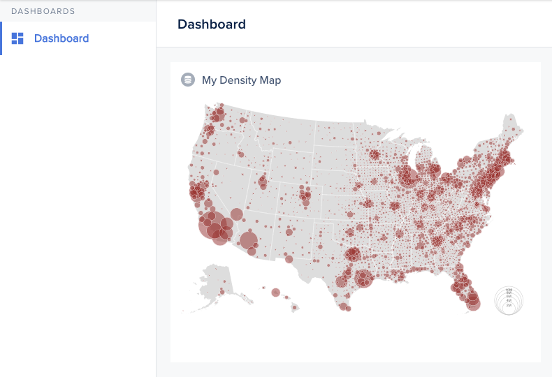

This last example shows how you can achieve virtually anything, since you are basically coding in a sandbox. There's no limit to what you can do with Smart charts.



```Handlebars
<div class="c-smart-view">{{this.chart}}</div>
```





```javascript
import Component from '@glimmer/component';
import { loadExternalStyle, loadExternalJavascript } from 'client/utils/smart-view-utils';
import { action } from '@ember/object';
import { tracked } from '@glimmer/tracking';

export default class extends Component {
  constructor(...args) {
    super(...args);

    this.loadPlugin();
  }

  @tracked chart;
  @tracked loaded = false;

  async loadPlugin() {
    await loadExternalJavascript('https://d3js.org/d3.v6.min.js');
    await loadExternalJavascript('https://unpkg.com/topojson-client@3');

    this.loaded = true;
    this.renderChart();
  }

  @action
  async renderChart() {
    if (!this.loaded) {
      return;
    }

    const height = 610;
    const width = 975;
    const format = d3.format(',.0f');
    const path = d3.geoPath();

    // This is the JSON for drawing the contours of the map
    // Ref.: https://github.com/d3/d3-fetch/blob/v2.0.0/README.md#json
    const us = await d3.json(
      'https://static.observableusercontent.com/files/6b1776f5a0a0e76e6428805c0074a8f262e3f34b1b50944da27903e014b409958dc29b03a1c9cc331949d6a2a404c19dfd0d9d36d9c32274e6ffbc07c11350ee?response-content-disposition=attachment%3Bfilename*%3DUTF-8%27%27counties-albers-10m.json',
    );
    const features = new Map(
      topojson.feature(us, us.objects.counties).features.map(d => [d.id, d]),
    );
    // Population should contain data about the dencity
    const population = await d3.json(
      'https://static.observableusercontent.com/files/beb56a2d9534662123fa352ffff2db8472e481776fcc1608ee4adbd532ea9ccf2f1decc004d57adc76735478ee68c0fd18931ba01fc859ee4901deb1bee2ed1b?response-content-disposition=attachment%3Bfilename*%3DUTF-8%27%27population.json',
    );

    const data = population.slice(1).map(([population, state, county]) => {
      const id = state + county;
      const feature = features.get(id);
      return {
        id,
        position: feature && path.centroid(feature),
        title: feature && feature.properties.name,
        value: +population,
      };
    });

    const radius = d3.scaleSqrt([0, d3.max(data, d => d.value)], [0, 40]);

    const svg = d3.create('svg').attr('viewBox', [0, 0, width, height]);

    svg
      .append('path')
      .datum(topojson.feature(us, us.objects.nation))
      .attr('fill', '#ddd')
      .attr('d', path);

    svg
      .append('path')
      .datum(topojson.mesh(us, us.objects.states, (a, b) => a !== b))
      .attr('fill', 'none')
      .attr('stroke', 'white')
      .attr('stroke-linejoin', 'round')
      .attr('d', path);

    const legend = svg
      .append('g')
      .attr('fill', '#777')
      .attr('transform', 'translate(915,608)')
      .attr('text-anchor', 'middle')
      .style('font', '10px sans-serif')
      .selectAll('g')
      .data(radius.ticks(4).slice(1))
      .join('g');

    legend
      .append('circle')
      .attr('fill', 'none')
      .attr('stroke', '#ccc')
      .attr('cy', d => -radius(d))
      .attr('r', radius);

    legend
      .append('text')
      .attr('y', d => -2 * radius(d))
      .attr('dy', '1.3em')
      .text(radius.tickFormat(4, 's'));

    svg
      .append('g')
      .attr('fill', 'brown')
      .attr('fill-opacity', 0.5)
      .attr('stroke', '#fff')
      .attr('stroke-width', 0.5)
      .selectAll('circle')
      .data(data.filter(d => d.position).sort((a, b) => d3.descending(a.value, b.value)))
      .join('circle')
      .attr('transform', d => `translate(${d.position})`)
      .attr('r', d => radius(d.value))
      .append('title')
      .text(d => `${d.title} ${format(d.value)}`);

    this.chart = svg.node();
  }
}
```



In the above snippet, notice how we import the **D3js** library. Of course, you can choose to use any other library of your choice.


This density map chart is inspired from [this one](https://observablehq.com/@d3/bubble-map).


The resulting chart can be resized to fit your use.
