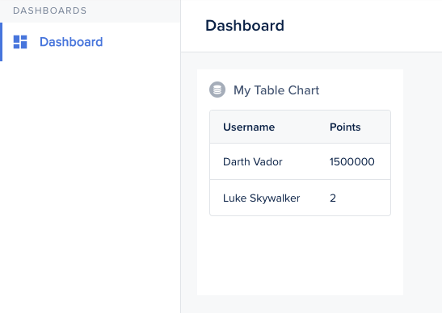

Our first Smart Chart example will be a simple table: however you may choose to make it as complex and customized as you wish.

We will code it in three steps:

1. Creating the chart in your agent (so that the data can be dynamically loaded)
2. Loading that data inside of the component (and passing it down to the template)
3. Writing a template

 

```javascript
agent.addChart('myTableChart', async (context, resultBuilder) => {
  // You may want to load the data dynamically
  // [...]

  return resultBuilder.smart([
    { username: 'Darth Vador', points: 1500000 },
    { username: 'Luke Skywalker', points: 2 },
  ]);
});
```

 

```javascript
import Component from '@glimmer/component';
import { inject as service } from '@ember/service';
import { tracked } from '@glimmer/tracking';

export default class extends Component {
  @service lianaServerFetch;
  @tracked users;

  constructor(...args) {
    super(...args);
    this.fetchData();
  }

  /** Load data from agent, and pass it to the template */
  async fetchData() {
    const response = await this.lianaServerFetch.fetch('/forest/_charts/myTableChart', {});
    this.users = await response.json();
  }
}
```

 

```handlebars
<BetaTable
  @columns={{array 'Username' 'Points'}}
  @rows={{this.users}}
  @alignColumnLeft={{true}}
  as |RowColumn user|
>
  <RowColumn>
    <span>{{user.username}}</span>
  </RowColumn>
  <RowColumn>
    <span>{{user.points}}</span>
  </RowColumn>
</BetaTable>
```

 
