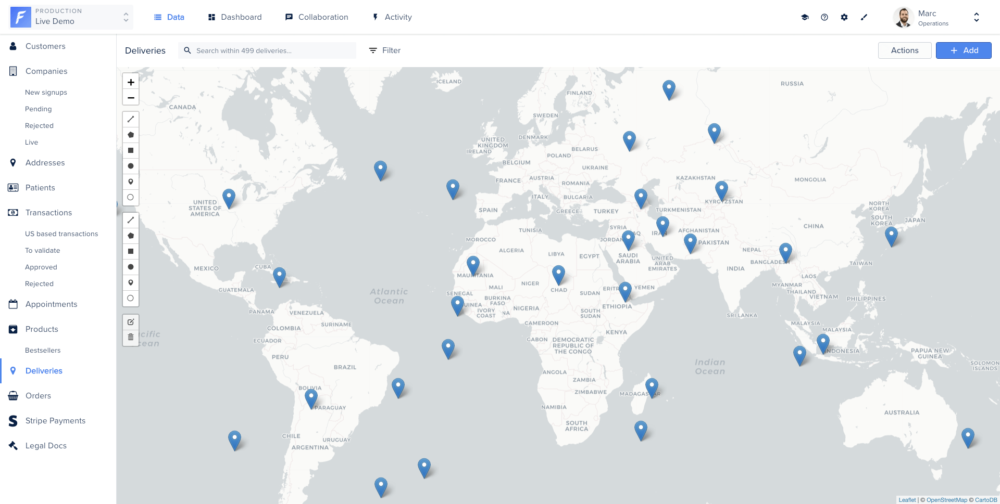
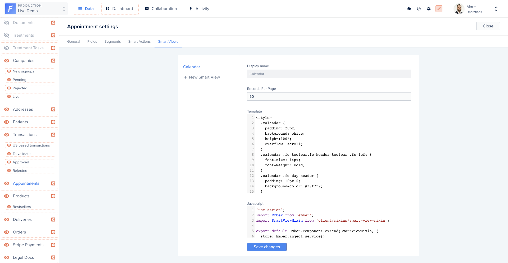
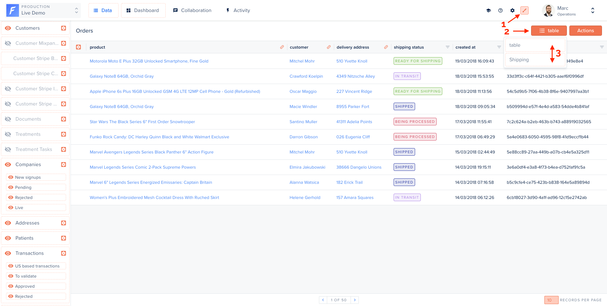
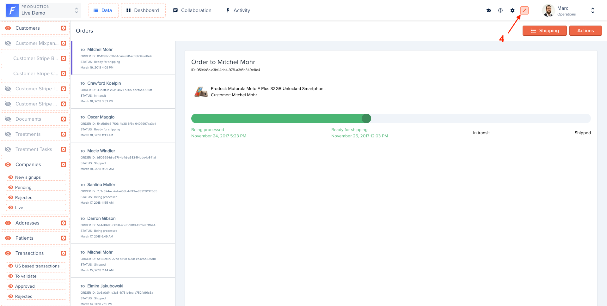
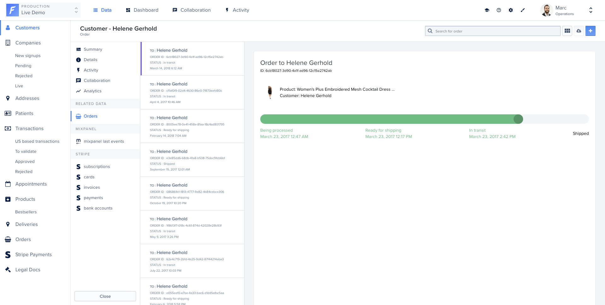
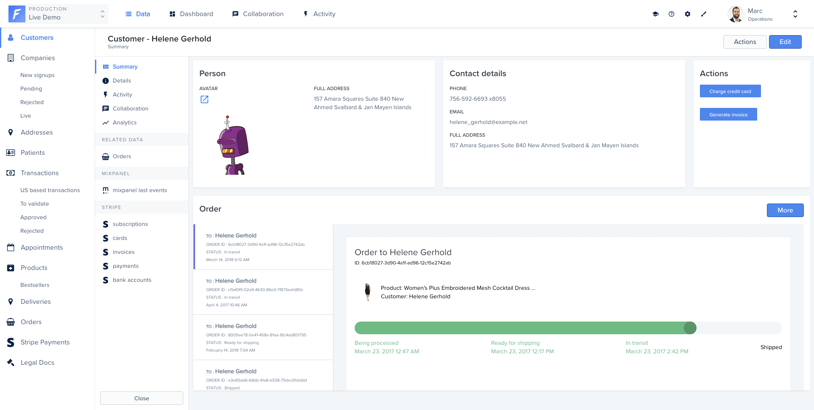

# Smart Views

## What is a Smart View?;

Smart Views lets you code your view using JS, HTML, and CSS. They are taking data visualization to the next level. Ditch the table view and display your orders on a Map, your events in a Calendar, your movies, pictures and profiles in a Gallery. All of that with the easiness of Forest Admin.



## Creating a Smart View

Forest Admin provides an online editor to inject your Smart View code. The editor is available on the collection’s settings, then in the “Smart views” tab.



The code of a Smart View is an [Glimmer Component](https://api.emberjs.com/ember/3.28/modules/@glimmer%2Fcomponent) and simply consists of a Template and Javascript code. <!-- markdown-link-check-disable-line -->


You don’t need to know the **Ember.js** framework to create a Smart View. We will guide you here on all the basic requirements.

For more advanced usage, you can still refer to the [Glimmer Component](https://api.emberjs.com/ember/3.28/modules/@glimmer%2Fcomponent) and the [Handlebars Template](https://guides.emberjs.com/v3.28.0/components/) documentations. <!-- markdown-link-check-disable-line -->


### Getting your records

The records of your collection are accessible from the records property. Here’s how to iterate over them in the template section:

```handlebars
{{#each @records as |record|}}{{/each}}
```

### Accessing a specific record

For each record, you will access its attributes through the `forest-attribute` property. The `forest-` preceding the field name **is required**.

```handlebars
{{#each @records as |record|}}
  <p>status: {{record.forest-shipping_status}}</p>
{{/each}}
```

### Accessing belongsTo relationships

Accessing a `belongsTo` relationship works in exactly the same way as accessing a simple field. Forest triggers automatically an API call to retrieve the data from your Admin API only if it’s necessary.

On the `Shipping` Smart View (in the collection named `Order`) defined on our Live Demo example, we’ve displayed the full name of the customer related to an order.

```handlebars
{{#each @records as |record|}}
  <h2>
    Order to
    {{record.forest-customer.forest-firstname}}
    {{record.forest-customer.forest-lastname}}
  </h2>
{{/each}}
```

### Accessing hasMany relationships

Accessing a `hasMany` relationship works in exactly the same way as accessing a simple field.. Forest triggers automatically an API call to retrieve the data from your Admin API only if it’s necessary.

```handlebars
{{#each @records as |record|}}
  {{#each @record.forest-comments as |comment|}}
    <p>{{comment.forest-text}}</p>
  {{/each}}
{{/each}}
```

### Refreshing data

Trigger the `fetchRecords` action in order to refresh the records on the page.

```handlebars
<button {{on 'click' @fetchRecords}}>
  Refresh data
</button>
```

### Fetching data

Trigger an API call to your Admin API in order to fetch records from any collection and with any filters you want.

We will use the `store` service for that purpose. Check out the list of all available services from your Smart View.

In our Live Demo example, the collection `appointments` has a `Calendar` Smart View. When you click on the previous or next month, the Smart View fetches the new events in the selected month. The result here is set to the property`appointments`. You can access it directly from your template.



```javascript
import Component from '@glimmer/component';
import { inject as service } from '@ember/service';
import { tracked } from '@glimmer/tracking';

export default class extends Component {
  @service store;

  @tracked appointments;

  async fetchData(startDate, endDate) {
    const params = {
      filters: JSON.stringify({
        aggregator: 'And',
        conditions: [{
          field: 'start_date',
          operator: 'GreaterThan'
          value: startDate,
        }, {
          field: 'start_date',
          operator: 'LessThan'
          value: endDate,
        }],
      }),
      timezone: 'America/Los_Angeles',
      'page[number]': 1,
      'page[size]': 50
    };

    this.appointments = await this.store.query('forest_appointment', params);
  }
  // ...
};
```





```handlebars
{{#each this.appointments as |appointment|}}
  <p>{{appointment.id}}</p>
  <p>{{appointment.forest-name}}</p>
{{/each}}
```



#### Available parameters

| Parameter     | Type   | Description                                                                                                                                                                                                                                                                                                                                                                                                                                                                                                                                                                                                                                                                                                                                                                                                                                                                                                                                       |
| ------------- | ------ | ------------------------------------------------------------------------------------------------------------------------------------------------------------------------------------------------------------------------------------------------------------------------------------------------------------------------------------------------------------------------------------------------------------------------------------------------------------------------------------------------------------------------------------------------------------------------------------------------------------------------------------------------------------------------------------------------------------------------------------------------------------------------------------------------------------------------------------------------------------------------------------------------------------------------------------------------- |
| filters       | Object | <p>A stringified JSON object containing either:</p><ul><li>a filter</li><li>an aggregation of several filters</li></ul><p>A filter is built using the following template:</p><p> <code>{</code></p><p> <code>field: &#x3C;a field name></code></p><p> <code>operator: &#x3C;an operator name></code></p><p> <code>value: &#x3C;a value></code></p><p> <code>}</code></p><p></p><p>An aggregation is built using the following template</p><p> <code>{</code></p><p> <code>aggregator: &#x3C;and or or></code></p><p> <code>conditions: &#x3C;an array of filters or aggregations></code></p><p> <code>}</code></p><p><br>List of available operators is: <code>less_than</code>, <code>greater_than</code>, <code>equal</code>, <code>after</code>, <code>before</code>, <code>contains</code>, <code>starts_with</code>, <code>ends_with</code>, <code>not_contains</code>, <code>present</code>, <code>not_equal</code>, <code>blank</code></p> |
| timezone      | String | The timezone string. Example: `America/Los_Angeles`.                                                                                                                                                                                                                                                                                                                                                                                                                                                                                                                                                                                                                                                                                                                                                                                                                                                                                              |
| page\[number] | Number | The page number you want to fetch.                                                                                                                                                                                                                                                                                                                                                                                                                                                                                                                                                                                                                                                                                                                                                                                                                                                                                                                |
| page\[size]   | Number | The number of records per page you want to fetch.                                                                                                                                                                                                                                                                                                                                                                                                                                                                                                                                                                                                                                                                                                                                                                                                                                                                                                 |

### Deleting records

The `deleteRecords` action lets you delete one or multiple records. A pop-up will automatically ask for a confirmation when a user triggers the delete action.



```handlebars
{{#each @records as |record|}}
  <Button::BetaButton
    @type='danger'
    @text='Delete record'
    @action={{fn this.deleteRecords record}}
    @async={{false}}
  />
{{/each}}
```



### Triggering an Action


Please note that the smart action triggering in the context of the smart view editor can be broken as you might not have access to all the required information. We advise you to test the smart action execution from the smart view applied to the collection view.


Here’s how to trigger your [Actions](../../agent-customization/actions/README.md) directly from your Smart Views.




```handlebars
<Button::BetaButton
  @type='primary'
  @text='Reschedule appointment'
  @action={{fn this.triggerSmartAction @collection 'Reschedule' record}}
/>
```





```javascript
import Component from '@glimmer/component';
import { action } from '@ember/object';
import { triggerSmartAction } from 'client/utils/smart-view-utils';

export default class extends Component {
  @action
  triggerSmartAction(...args) {
    return triggerSmartAction(this, ...args);
  }

  @action
  deleteRecords(...args) {
    return deleteRecords(this, ...args);
  }
}
```




`triggerSmartAction` function imported from `'client/utils/smart-view-utils'`has the following signature:

```javascript
function triggerSmartAction(
  context, collection, actionName, records, callback = () => {}, values = null,
)
```

| Argument name | Description                                                                                                             |
| ------------- | ----------------------------------------------------------------------------------------------------------------------- |
| context       | Context is the reference to the component, in the smart view it is accessible through the keyword `this`                |
| collection    | The `collection` that has the Smart Action                                                                              |
| actionName    | The Smart Action name                                                                                                   |
| records       | An array of records or a single one                                                                                     |
| callback      | A function executed after the smart action that takes as the single parameter the result of the smart action execution. |
| values        | An object containing the values to be passed for the smart action fields                                                |

Here is an example of how to trigger the smart action with the values passed from the code, you only need to do it if you **don't** want to use the built-in [smart action form](../../agent-customization/actions/forms.md)




```handlebars
<Button::BetaButton
  @type='primary'
  @text='Reschedule appointment'
  @action={{fn this.rescheduleToNewTime record}}
/>
```





```javascript
import Component from '@glimmer/component';
import { action } from '@ember/object';
import { triggerSmartAction } from 'client/utils/smart-view-utils';
import { tracked } from '@glimmer/tracking';

export default class extends Component {
  @tracked newTime = '11:00';

  @action
  triggerSmartAction(actionName, records, values) {
    return triggerSmartAction(this, this.args.collection, actionName, records, () => {}, values);
  }

  @action
  rescheduleToNewTime(record) {
    this.triggerSmartAction('Reschedule', record, { newTime });
  }

  @action
  deleteRecords(...args) {
    return deleteRecords(this, ...args);
  }
}
```




### Available properties

Forest Admin automatically injects into your Smart View some properties to help you display your data like you want.

| Property        | Type    | Description                                            |
| --------------- | ------- | ------------------------------------------------------ |
| `collection`    | Model   | The current collection.                                |
| `currentPage`   | Number  | The current page.                                      |
| `isLoading`     | Boolean | Indicates if the UI is currently loading your records. |
| `numberOfPages` | Number  | The total number of available pages                    |
| `records`       | array   | Your data entries.                                     |
| `searchValue`   | String  | The current search.                                    |

### Available actions

Forest Admin automatically injects into your Smart View some actions to trigger the logic you want.

| Action                                               | Description                                                             |
| ---------------------------------------------------- | ----------------------------------------------------------------------- |
| `deleteRecords(records)`                             | Delete one or multiple records.                                         |
| `triggerSmartAction(collection, actionName, record)` | Trigger a Smart Action defined on the specified collection on a record. |

## Applying a Smart View

To apply a Smart view you created, turn on the Layout Editor mode **(1)**, click on the table button **(2)** and drag & drop your Smart View's name in first position inside the dropdown **(3)**:



Your view will refresh automatically. You can now turn off the Layout Editor mode **(4)**.



### Impact on related data

Once your Smart view is applied, it will also be displayed in your record's related data.

#### In the related data section



#### In the summary view




As of today, it's **not** possible to set different views for your table/summary/related data views.

