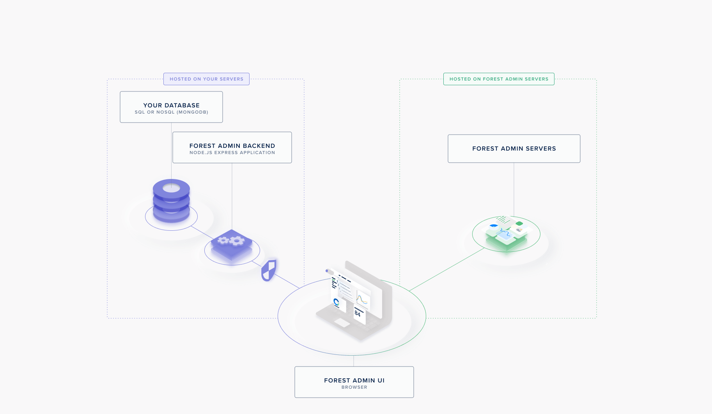

# How it works

Before you start writing a single line of code, it’s a good idea to get an overview of how Forest Admin works. The magic lies in its architecture.

Forest Admin provides you with:

- An API, hosted on your server, to retrieve your data. We call it the **Agent**. It can be a **standalone project** or embedded **within your app**.
- A user interface, to access and manage your data from your browser. This **Forest Admin User Interface** is built and managed through resources hosted on Forest Admin's servers.


For a more in-depth explanation of Forest Admin's architecture (the Node.JS agent version), please read the [following article](https://medium.com/forest-admin/a-deep-dive-into-forest-admins-architecture-and-its-benefits-for-the-developers-who-trust-it-1d49212fb4b).


## The agent

The agent is generated upon installation and **hosted on your end**.

It includes an API allowing you to **translate calls made from the Forest Admin UI into queries** to your database (covering actions such as CRUD, search & filters, pagination, sorting, etc.).

It also provides the Forest Admin servers with the information needed to build the User Interface (the **Forest Admin Schema**). This information includes table names, column names and types, and relationships. It is sent when you run your agent within a file called `forestadmin-schema.json`.
