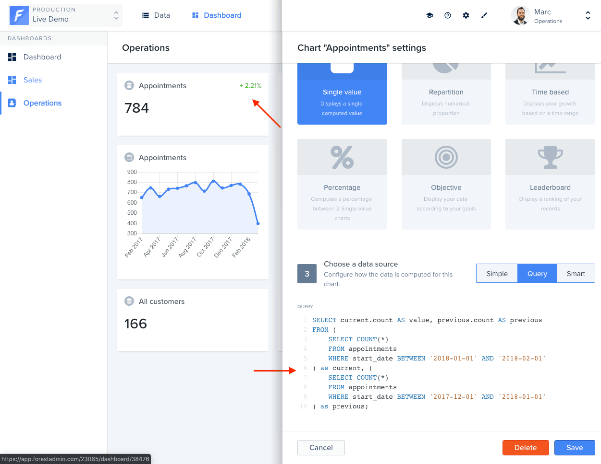

You may want to migrate from a legacy agent to this new agent. This guide will help you do so.

The new agent is built with a different architecture and breaks API retro compatibility with the legacy agents in many ways. However, because all features are available in the new agent, you can still migrate to it.

# Am I using a legacy agent?

You are using a legacy agent if you are using either the [forest-express-sequelize](https://github.com/ForestAdmin/forest-express-sequelize) or the [forest-express-mongoose](https://github.com/ForestAdmin/forest-express-mongoose) packages.

# When to migrate?

Legacy agents are still supported and will continue to be for a while.

No end-of-life date has been set yet for customers using the latest major version of the legacy agents, but it will be announced on a minimal 18 months period guarantee.

To give more visibility to our developers' community, about agent usability and support in the future, you will find [on this page](https://docs.forestadmin.com/documentation/how-tos/releases-support) the important lifecycle dates per agent stack and versions.

# Missing features

The new agent brings a lot of new features, but a small subset of what was available in the legacy agents is not yet there.

## Route overrides

[Route overrides](https://docs.forestadmin.com/documentation/reference-guide/routes/override-a-route) allowed customizing the behavior of the routes exposed by the agent.

Because our new agent API is higher-level, the protocol used to communicate between the agent and the application can no longer be manipulated.

All use cases that we have seen so far can be implemented using the new [agent customization](../../agent-customization) system, but because the former system was lower-level, we cannot guarantee it.

A specific [migration guide](./steps/customizations/route-overrides.md) is available for this feature.

## "Live Query" charts


Due to popular demand, it is planned to be reintroduced in a future version of the agent, but we don't have a timeline for it yet.


[Live Query Charts](https://docs.forestadmin.com/user-guide/dashboards/charts/create-a-chart#creating-a-chart-with-sql) allowed the creation of charts from SQL queries from the UI.

Because the new agent no longer exposes the nature of the underlying database, this feature was not ported into the new agent.

You will need to follow the specific [migration guide](./steps/customizations/live-query-charts.md) to convert `Live query charts` into `API charts`.
