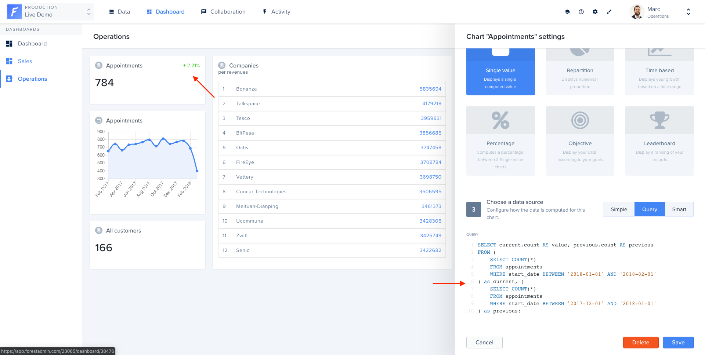

# Role system

The Forest Admin role system got a complete overhaul in February 2021.

If your project was created before that date, you will need to migrate your role system to the new one before you can upgrade to the latest version of the agent.

A [migration guide](https://docs.forestadmin.com/documentation/v/latest/how-tos/maintain/migrate-to-the-new-role-system) is available in the documentation of the legacy agents.

# Missing features

The new agent brings a lot of new features, but a small subset of what was available in the legacy agents is not yet there.

## Route overrides

[Route overrides](https://docs.forestadmin.com/documentation/reference-guide/routes/override-a-route) allowed customizing the behavior of the routes exposed by the agent.

Because our new agent API is higher-level, the protocol used to communicate between the agent and the application can no longer be manipulated.

All use cases that we have seen so far can be implemented using the new [agent customization](../../agent-customization) system, but because the former system was lower-level, we cannot guarantee it.

If you are stuck, please [expose your use-case in the community forums](https://community.forestadmin.com/) and we will be happy to help you.

## SQL Charts

[SQL Charts](https://docs.forestadmin.com/user-guide/dashboards/charts/create-a-chart#creating-a-chart-with-sql) allowed the creation of charts from SQL queries from the UI.

In the new agent, building a chart from SQL queries is only possible [through code](../../agent-customization/charts/README.md).

Because the new agent no longer exposes the nature of the underlying database, this feature was not ported into the new agent.

Due to popular demand, it is planned to be reintroduced in a future version of the agent, but we don't have a timeline for it yet.
