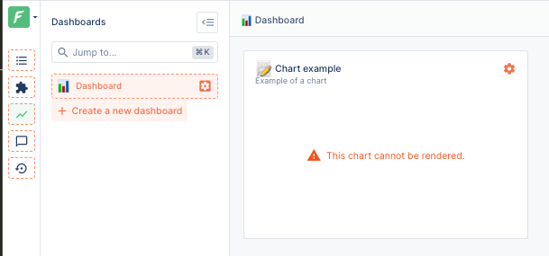

# Checklist

## Checking that the agents are compatible

Making an agent which works is not enough: you also need to make sure that it generates a schema where the naming of most entities is the same as the old one.

This is because all the UI / and security customizations that you have made are identified by the name of the entity to which they are applied.

This is valid for:

- Charts (in dashboards and the collection view)
- Order and visibility of fields in table-view, detail-form, related data, segments
- Roles and Scopes
- Segments visibility
- Summary views and Workspaces

### Example



For instance, if you created a chart on the `customers` collection that displays the TOP 10 customers by number of orders, you will need to make sure that:

- The `customers` collection still exists and has the same name
- The `orders` collection still exists and has the same name
- The `customers` collection still has a relationship called `orders`

### Checking the compatibility with `.forestadmin-schema.json`, `jq` and `diff`


Note that if you want to skip the installation step, online versions of both tools are available and can be used from an internet browser.

- `jq` is a command line tool that allows you to manipulate JSON files.
  If you don't have it installed, you can install it with [one of the following methods](https://stedolan.github.io/jq/download/).
- `diff` is a command line tool that allows you to compare two files.
  It is installed by default on virtually all Unix systems.



To ensure agents are compatible, we have a tool at our disposal: [the `.forestadmin-schema.json` file](../../../under-the-hood/forestadmin-schema.md).

However, diffing two `.forestadmin-schema.json` files is _extremely_ tedious: the file contains a lot of information that is not relevant to our objective.

Instead, we can choose to focus on the differences that matter the most: the name of the different entities.

#### Extracting the list of entities

Extracting the list of entities exported by an agent can be done with the following `jq` command.

Run this command in the directory of both your old and new agent: it will generate a file called `agent-entities.txt` in the current directory.

```console
$ jq -r '.collections[] | (
    "Collection: \"\(.name)\"",
    "Action: \"\(.name)\" has \"\(.actions[].name)\"",
    "Field: \"\(.name)\" has \"\(.fields[] | select(.reference == null) | .field)\"",
    "Relationship: \"\(.name)\" has \"\(.fields[] | select(.reference) | .field)\"",
    "Segment: \"\(.name)\" has \"\(.segments[].name)\""
)' .forestadmin-schema.json | sort > agent-entities.txt
```

This is equivalent to running the following Node.js script:

```javascript
const fs = require('fs');
const forestAdminSchema = require('./.forestadmin-schema.json');

const entities = forestAdminSchema.collections
  .map(collection => [
    `Collection: "${collection.name}"`,
    ...collection.actions.map(action => `Action: "${collection.name}" has "${action.name}"`),
    ...collection.fields
      .filter(field => !field.reference)
      .map(field => `Field: "${collection.name}" has "${field.field}"`),
    ...collection.fields
      .filter(field => field.reference)
      .map(field => `Relationship: "${collection.name}" has "${field.field}"`),
    ...collection.segments.map(segment => `Segment: "${collection.name}" has "${segment.name}"`),
  ])
  .flat()
  .sort();

fs.writeFileSync('agent-entities.txt', entities.join('\n'));
```

#### Comparing the list of entities

Once you have generated the `agent-entities.txt` file for both your old and new agent, you can diff them with the following command:

```console
$ diff --side-by-side --suppress-common-lines --minimal [old-agent-folder]/agent-entities.txt [new-agent-folder]/agent-entities.txt
Collection: "account"                    <
Field: "account" has "_id"               <
Field: "account" has "firstname"         <
Field: "account" has "lastname"          <
Field: "account_address" has "_id"       <
Field: "account_address" has "country"   | Field: "account_address" has "Country"
Relationship: "account" has "address"    <
Relationship: "account" has "bills"      <
Relationship: "account" has "store"      <
```

Diff files are read using the following format:

- `>`: line is present in the new file, but not in the old one
- `<`: line is present in the old file, but not in the new one
- '|': line is present in both files, but the content is different

### Fixing differences

Once you have identified the differences, you can fix them by:

| Danger level | Difference                                                                    | Fix                                                                                                                    |
| ------------ | :---------------------------------------------------------------------------- | :--------------------------------------------------------------------------------------------------------------------- |
| 🔴           | Collections or fields have different names (i.e. `camelCase` vs `snake_case`) | Rename the collections in the new agent ([docs](../../../datasources/connection/naming-conflicts.md))                  |
| 🔴           | Missing Smart features (actions, fields, relationships, segments, ...)        | Port the missing smart features to your new agent ([docs](./customizations))                                           |
| 🟢           | Extra collections                                                             | You can remove them ([docs](../../../datasources/connection/partial-imports.md))                                       |
| 🟢           | Extra fields                                                                  | You can remove them ([docs](../../../agent-customization/fields/import-rename-delete.md#renaming-and-removing-fields)) |
