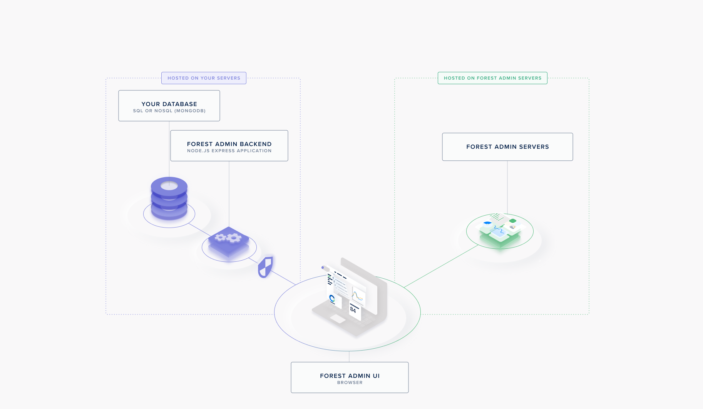

# How it works

Before you start writing a single line of code, it’s a good idea to get an overview of how Forest Admin works. The magic lies in its architecture.

Forest Admin provides you with:

- An API hosted on your server to retrieve your data. We call it the Admin Backend
- A user interface to access and manage your data from your browser. This Forest Admin User Interface is built and managed through ressources hosted on Forest Admin's servers.



# Quick start

## Creating your agent



```javascript
const Agent = require('@forestadmin/agent');
const VideoClubDataSource = require('@forestadmin/datasource-videoclub');

// Create agent
const agent = new Agent({
  isProduction: false
  agentUrl: 'http://localhost:3351',
  authSecret: process.env.FOREST_AUTH_SECRET,
  envSecret: process.env.FOREST_ENV_SECRET,
});

// Connect it to dummy data so that we're up and running in no time.
agent.addDataSource(new VideoClubDataSource());

module.exports = agent;
```



## Exposing your agent to the outside world

 

```javascript
const http = require('http');
const agent = require('./forest/agent');

// Mount agent on a native NodeJS HTTP server
const port = 3351;
const server = http.createServer(agent.httpCallback);
server.listen(port);
```




```javascript
const express = require('express');
const agent = require('./forest/agent');

// Create express app
const app = express();
const port = 3351;

// Agent is mounted on a dedicated prefix.
// It should go before mounting any middleware, as to avoid conflicts.
app.use('/forest', agent.httpCallback);

// Any route outsite of this prefix is free to use.
app.get('/', (req, res) => {
  res.send('Hello World!');
});

app.listen(port);
```

 

```javascript
const Koa = require('koa');
const agent = require('./forest/agent');

const app = new Koa();
const port = 3351;

// Agent is mounted on a dedicated prefix.
// It should go before mounting any middleware, as to avoid conflicts.
app.use('/forest', agent.httpCallback);

// Any route outsite of this prefix is free to use.
app.use(async ctx => {
  ctx.body = 'Hello World';
});

app.listen(port);
```

 
