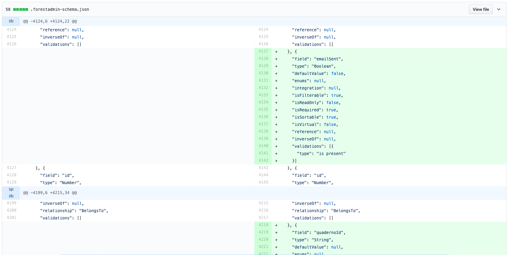

### The `.forestadmin-schema.json` file

On server start, a `.forestadmin-schema.json` file will be auto-generated in **local (development) environments only.** It reflects:

- the **state of your collections.**
- your **Forest Admin customisation**.


This file **must be versioned and deployed** for any remote environment (staging, production, etc.), as it will be used to generate your Forest UI.



We use the option `isProduction` in the `createAgent` function. You can use `isProduction: process.env.NODE_ENV === 'production'` to manipulate this behavior. Setting this variable to either `false` will regenerate a new _.forestadmin-schema.json_ file every time your app restarts. Using `true` will not regenerate the file.



A consequence of the above is, **in Production** the `.forestadmin-schema.json` file does **not** update according to your schema changes.



**Do not edit this file,** as it could break your interface if the wrong syntax is used.


Versioning the`.forestadmin-schema.json` file will also help you visualize your changes:



