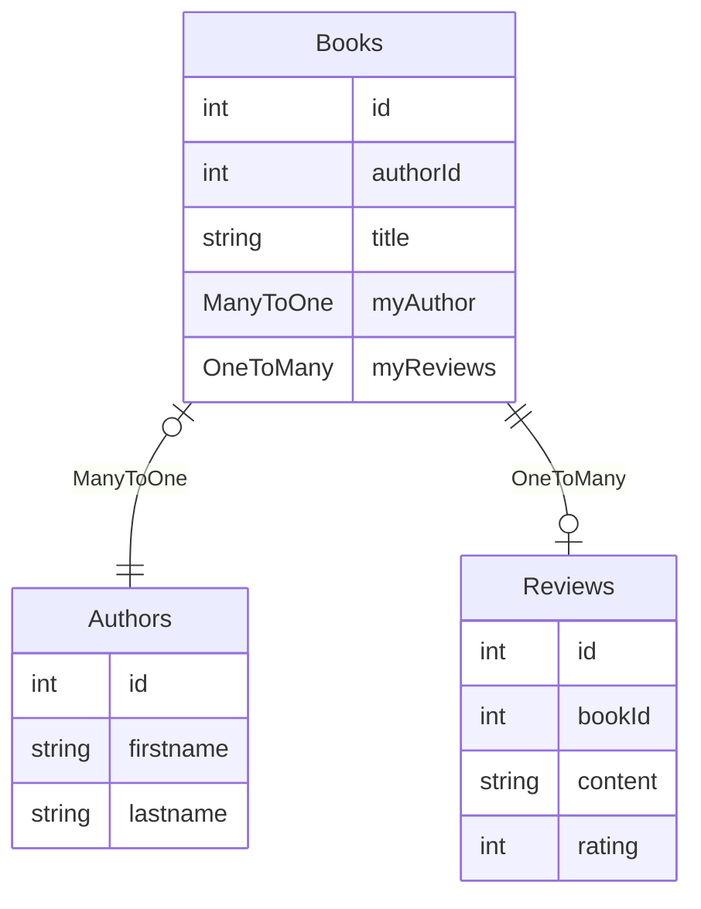

## Fields

Field identifiers simply are strings that identify a column in the context of a collection.

If we consider the following collections:




| Context | Field                | Valid ?                                                               |
| ------- | -------------------- | --------------------------------------------------------------------- |
| Books   | "title"              | Yes                                                                   |
| Books   | "myAuthor:firstname" | Yes                                                                   |
| Books   | "myReviews:content"  | No, only relationships which yield one record can be traversed        |
| Reviews | "content"            | Yes                                                                   |
| Reviews | "myBook:title"       | No, reverse relations are _not_ automatically defined in Forest Admin |

## Projections

Projections are mainly used to fetch partial records and automatically fetch linked records.

Projections simply are an array of fields.

```json
["id", "title", "author:firstName"] // for books
```
