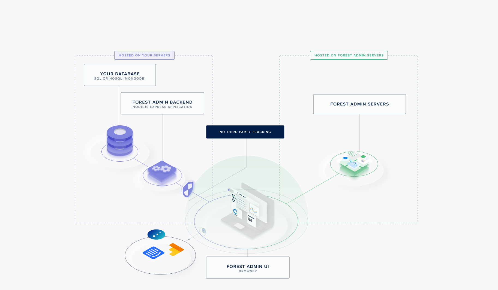
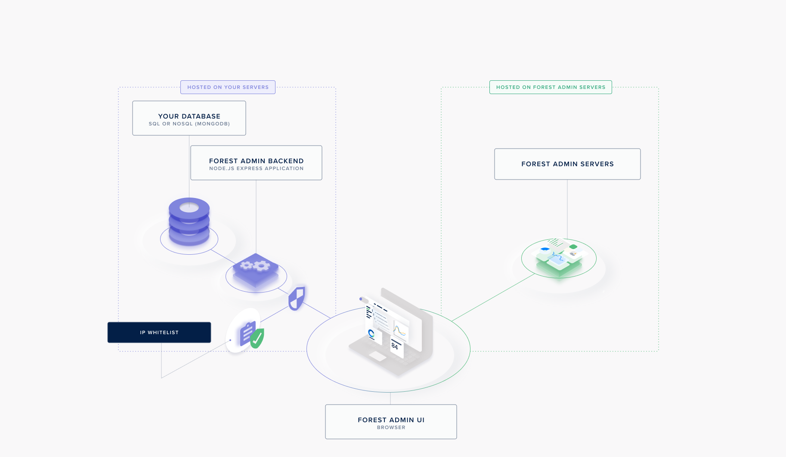

## Data Privacy

When logging into the **Forest Admin UI** in your browser, you will connect to:

1. The **Forest Admin servers** to retrieve the **Forest Admin UI.**
2. The **agent** to retrieve your **data** and populate the Forest Admin UI with it.


As your data transits directly from the agent hosted on your end and the user browser, **it never transits through our servers**.


.png>)

## Security

The connection to both servers to the **agent** and the **Forest Admin Servers** are protected using 2 different [**JWT**](https://jwt.io) signed by 2 different keys:

1. `FOREST_ENV_SECRET` to authenticate all requests made to the **Forest Admin Servers**
2. `FOREST_AUTH_SECRET` to authenticate all requests made to the **agent**



`FOREST_ENV_SECRET` is provided by Forest Admin and ensures your **agent** interacts with the relevant environment configuration on our end**.**

`FOREST_AUTH_SECRET` is chosen freely by you and is never disclosed to anyone**.**



The JWT Data Token contains all the details of the requesting user. On any authenticated request to your agent, you can access them with the variable `req.user`.



```javascript
{
  "id": "172",
  "email": "angelicabengtsson@doha2019.com",
  "firstName": "Angelica",
  "lastName": "Bengtsson",
  "team": "Pole Vault",
  "role": "Manager",
  "tags": [{ key: "country", value: "Canada" }],
  "renderingId": "4998",
  "iat": 1569913709,
  "exp": 1571123309
}
```




### **No 3rd-party Tracking**

The **Forest Admin UI** has an option to completely disable any 3rd-party provider that could track data available from your browser to guarantee the respect of data privacy.



### IP Whitelisting

The [IP whitelisting](broken-reference) feature allows you to create a list of trusted IP addresses or IP ranges from which your admin users can both access to the **Forest Admin UI** and interact with your **agent**.



### **DMZ & VPN**

You're free to host your **agent** in the cloud architecture you want to be compliant with your security infrastructure (DMZ, VPN, etc.).

.png>)

## Credentials

We’re already working with companies compliant with the following Industry Standard Certifications.

.png>)
