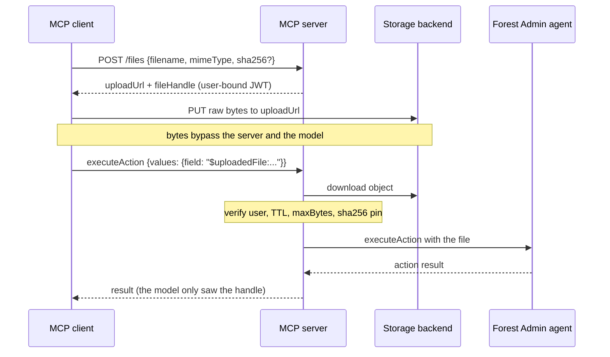

# @forestadmin/mcp-server

Model Context Protocol (MCP) server for Forest Admin with OAuth authentication support.

## Overview

This MCP server provides HTTP REST API access to Forest Admin operations, enabling AI assistants and other MCP clients to interact with your Forest Admin data through a standardized protocol.

### Available Tools

| Tool | Description |
|------|-------------|
| `describeCollection` | Get the schema of a collection (fields, types, relations) |
| `list` | Retrieve records from a collection |
| `listRelated` | Retrieve related records |
| `create` | Create a new record |
| `update` | Update an existing record |
| `delete` | Delete records |
| `associate` | Associate records in a relation |
| `dissociate` | Dissociate records from a relation |
| `getActionForm` | Get the form fields for a custom action |
| `executeAction` | Execute a custom action |

## Usage

### With Forest Admin Agent

The MCP server is included with the Forest Admin agent. Simply call `mountAiMcpServer()`:

```typescript
import { createAgent } from '@forestadmin/agent';

const agent = createAgent(options)
  .addDataSource(myDataSource)
  .mountAiMcpServer();

agent.mountOnExpress(app);
agent.start();
```

The MCP server will be automatically initialized and mounted on your application.

### Standalone Server

You can run the MCP server standalone using the CLI:

```bash
npx forest-mcp-server
```

Or from the package directory:

```bash
yarn start           # Production
yarn start:dev       # Development (loads .env file automatically)
```

#### Environment Variables

| Variable | Required | Default | Description |
|----------|----------|---------|-------------|
| `FOREST_ENV_SECRET` | **Yes** | - | Your Forest Admin environment secret |
| `FOREST_AUTH_SECRET` | **Yes** | - | Your Forest Admin authentication secret (must match your agent) |
| `MCP_SERVER_PORT` | No | `3931` | Port for the HTTP server |
| `FOREST_MCP_ENABLED_TOOLS` | No | - | Comma-separated list of tools to enable (allowlist) |
| `FOREST_MCP_ALLOWED_OAUTH_CLIENTS` | No | - | Comma-separated domains of the OAuth client applications allowed to connect (`allowedOAuthClients`). Unset, any registered client is accepted |
| `FOREST_AGENT_URL` | No | your environment's back-end URL | URL the MCP server uses to reach the back-end's data layer. Set it when the server runs next to a self-hosted back-end at an internal address (e.g. `http://localhost:3310`), instead of the public URL registered in Forest |
| `FOREST_MCP_ACCESS_TOKEN_TTL_SECONDS` | No | `3600` (1 hour) | Maximum lifetime of the OAuth access tokens the server issues (`tokenTtl.accessTokenSeconds`). Minimum `60` |
| `FOREST_MCP_REFRESH_TOKEN_TTL_SECONDS` | No | unbounded | Maximum time between two interactive logins (`tokenTtl.refreshTokenSeconds`). Unset, a client that keeps refreshing never signs in again. Minimum `60` |

#### Example Configuration

Create a `.env` file in the package directory:

```bash
FOREST_ENV_SECRET="your-env-secret"
FOREST_AUTH_SECRET="your-auth-secret"
```

Then run:

```bash
yarn start:dev
```

Or set the variables inline:

```bash
FOREST_ENV_SECRET="your-env-secret" FOREST_AUTH_SECRET="your-auth-secret" npx forest-mcp-server
```

## Restrict Tools

You can restrict which tools the MCP server exposes using `enabledTools`. Only the listed tools will be available. **New tools added in future releases will NOT be automatically enabled** — you must explicitly add them.

For example, to set up a **read-only mode** where the AI assistant can only browse data (no create, update, delete or action execution):

```typescript
// With Forest Admin Agent — read-only example
agent.mountAiMcpServer({
  enabledTools: ['describeCollection', 'list', 'listRelated'],
});
```

```bash
# Standalone
export FOREST_MCP_ENABLED_TOOLS="describeCollection,list,listRelated"
npx forest-mcp-server
```

When `enabledTools` is not set, all tools are enabled by default.

See [Available Tools](#available-tools) for the full list. `describeCollection` is always enabled as it is required for the MCP server to function properly.

## Restrict OAuth Clients

Any OAuth client can register against the MCP server through Dynamic Client Registration and, once one of your users signs in, obtain tokens. Use `allowedOAuthClients` to accept only approved client applications:

```typescript
// With Forest Admin Agent
agent.mountAiMcpServer({
  allowedOAuthClients: ['dust.tt'],
});
```

```bash
# Standalone
export FOREST_MCP_ALLOWED_OAUTH_CLIENTS="dust.tt"
npx forest-mcp-server
```

A client is allowed only when **every** redirect URI it registered is an `http(s)` URI on a listed domain or one of its subdomains (`dust.tt` matches `eu.dust.tt`); custom schemes are rejected because they deliver the callback to whatever local application registered them, regardless of hostname. Matching uses redirect URIs because they are the one piece of registration metadata an impostor cannot benefit from — the authorization code is only ever delivered there. Self-declared fields such as the client name are ignored.

List bare domains only — unicode domains are matched through their punycode form. An entry with a scheme, port, path, or spaces fails at startup, as does a configured value containing no domains at all: the allowlist never silently falls back to accepting or rejecting everyone on a malformed configuration.

Every other client is rejected with a standard `invalid_client` error telling the user to contact their administrator; the response does not reveal the allowed domains. Registration itself still succeeds — it happens on the Forest Admin server — the client just cannot use it against this server. Access tokens issued before you enabled the option stay valid until they expire (1 hour at most); refreshes are blocked immediately.

Native desktop clients (Claude Desktop, MCP Inspector, ...) register loopback (`localhost`) redirect URIs, which a domain allowlist never matches — they are rejected unless you explicitly list `localhost`, which would admit **every** local application and defeats the restriction. Omit the option in environments that need native clients (e.g. development).

## Shorten Token Lifetimes

Forest grants **1 hour** (3600s) for an access token and **8 days** (691200s) for a refresh token — but it re-grants those 8 days on *every* refresh, so without `refreshTokenSeconds` a client that keeps working is never asked to sign in again.

**Both values are upper bounds: they can only shorten that, never extend it.** For `accessTokenSeconds` a value above 3600 therefore has no effect. `refreshTokenSeconds` bounds the whole session, which Forest otherwise re-extends on every refresh, so any value shortens it however large it is.

```typescript
// With Forest Agent
agent.mountAiMcpServer({
  tokenTtl: { accessTokenSeconds: 900, refreshTokenSeconds: 86400 },
});
```

```bash
# Standalone
export FOREST_MCP_ACCESS_TOKEN_TTL_SECONDS=900
export FOREST_MCP_REFRESH_TOKEN_TTL_SECONDS=86400
npx forest-mcp-server
```

The two settings differ in what the user notices:

- `accessTokenSeconds` shortens how long a leaked access token can drive **this server**: the MCP path closes, its scopes stop applying and its calls stop being audited. It does **not** shorten the Forest token carried inside that JWT — the JWT is signed, not encrypted, so treat a leak as a Forest token leak and revoke at the source. It is transparent to users — the assistant silently obtains a new one.
- `refreshTokenSeconds` bounds the time between two **interactive logins**: once it elapses, the assistant can no longer refresh and the user signs in through the browser again. It is measured from the login itself, so an active assistant cannot keep extending its session. Refresh tokens issued before you enabled the option carry no login timestamp, so their window is measured from their last refresh instead — one longer session each, then bounded.

The minimum for either value is 60 seconds; anything lower is raised to it. An invalid value (zero, negative, fractional) fails at startup rather than silently leaving the tokens uncapped.

## Action File Uploads

> **Experimental.** The MCP specification is still designing its own file transfer story
> ([SEP-2631](https://github.com/modelcontextprotocol/modelcontextprotocol/pull/2631)). The
> `UploadStorage` contract is expected to survive, but the `POST /files` route and the handle
> format may change to follow the specification once it lands.

Actions with **File fields** cannot normally run over MCP. The agent expects file values as data
uris, which would transit the model's context window and exceed most MCP clients' payload limits.
The `fileUploads` option enables them through an upload side-channel that keeps the bytes out of
the conversation:

1. The client `POST`s `/files` (same Bearer token as `/mcp`) with `{ "filename", "mimeType", "sha256"? }` and receives a pre-authorized upload URL plus a signed `fileHandle` string.
2. The client uploads the raw bytes directly to the storage backend, so they never pass through the MCP server or the model.
3. The client passes the handle (`"$uploadedFile:<...>"`) as the field value in `executeAction`. The server downloads the object and hands it to the agent. The model only ever exchanges the small handle.

It is available on the embedded mount too: `agent.mountAiMcpServer({ fileUploads: { storage } })`.



The storage backend is pluggable, and this package has no storage dependency. Provide an
implementation of `UploadStorage`; any backend that can pre-authorize an upload and read the object
back works, such as S3 presigned URLs (below), GCS signed URLs, Azure SAS, or an endpoint you serve
yourself. The only hard requirement is that the URL be reachable from the MCP client, since that is
what uploads the bytes.

```typescript
import {
  S3Client,
  GetObjectCommand,
  HeadObjectCommand,
  PutObjectCommand,
} from '@aws-sdk/client-s3';
import { getSignedUrl } from '@aws-sdk/s3-request-presigner';
import type { UploadStorage } from '@forestadmin/mcp-server';

const s3 = new S3Client({});
const bucket = 'my-uploads-bucket';

const storage: UploadStorage = {
  async createUploadUrl({ key, mimeType, sha256, expiresInSeconds }) {
    const command = new PutObjectCommand({
      Bucket: bucket,
      Key: key,
      ContentType: mimeType,
      ...(sha256 && { ChecksumSHA256: sha256 }),
    });
    const url = await getSignedUrl(s3, command, {
      expiresIn: expiresInSeconds,
      ...(sha256 && { unhoistableHeaders: new Set(['x-amz-checksum-sha256']) }),
    });
    return {
      url,
      headers: { 'Content-Type': mimeType, ...(sha256 && { 'x-amz-checksum-sha256': sha256 }) },
    };
  },
  async getSize(key) {
    const head = await s3.send(new HeadObjectCommand({ Bucket: bucket, Key: key }));
    return head.ContentLength;
  },
  async download(key) {
    const object = await s3.send(new GetObjectCommand({ Bucket: bucket, Key: key }));
    return Buffer.from(await object.Body.transformToByteArray());
  },
};

const server = new ForestMCPServer({
  // ...
  fileUploads: { storage },
});
```

The other options are `keyPrefix` (default `mcp-uploads/`), `uploadUrlTtlSeconds` (default 15 min),
`handleTtlSeconds` (default 45 min, longer than the upload URL so a slow upload still leaves time to
run the action), `maxBytes` (default 20 MiB), and `maxConcurrentDownloads` (default 5).

A few properties matter in production.

- The server stays stateless. The handle is a JWT signed with `authSecret`, so there is no database and no session affinity, and any replica can redeem a handle issued by another.
- A handle is bound to the user it was issued to. Only that user's Bearer token can redeem it, and it expires with `handleTtlSeconds`. It stays redeemable until then, so keep the TTL short.
- When the client sends `sha256` (hex or base64), the upload URL is pinned to that digest and the digest is checked again on the downloaded bytes at redemption. Content substituted after an upload URL leak cannot be redeemed.
- **`maxBytes` does not bound memory on its own.** A pre-authorized upload URL cannot always cap the object size, so the limit is enforced at redemption: before downloading when `getSize` reports a size, and only after the bytes are in memory when it returns `undefined`. Implement `getSize` whenever the backend can answer it cheaply.
- **`maxConcurrentDownloads` bounds concurrent downloads, not peak memory.** All the files one `executeAction` call references are held together until the call completes, so a form with N file fields holds up to N × `maxBytes` whatever the concurrency limit is. Size `maxBytes` against the number of file fields your actions declare.
- The server never deletes objects. Configure a lifecycle rule on the storage backend, for example deleting objects under `keyPrefix` after one day.

Only `executeAction` resolves handles. `getActionForm` echoes field values back to the model, so a
handle stays a handle there: resolving it would put the file content back into the model's context.
A file field that declares a change hook therefore sends the unresolved handle to that hook, which
receives it as a plain string rather than a parsed file.

## API Endpoints

Once running, the MCP server exposes the following endpoints:

| Method | Path | Description |
|--------|------|-------------|
| POST | `/mcp` | Main MCP protocol endpoint (requires Bearer token) |
| POST | `/files` | Upload side-channel for action file fields (only with `fileUploads`; requires Bearer token) |
| POST | `/oauth/authorize` | OAuth 2.0 authorization |
| POST | `/oauth/token` | OAuth 2.0 token exchange |
| GET | `/.well-known/oauth-protected-resource/mcp` | OAuth metadata discovery |

The `/mcp` endpoint expects MCP protocol messages (JSON-RPC 2.0) and requires a valid OAuth Bearer token with at least the `mcp:read` scope.

## Features

- **HTTP Transport**: Uses streamable HTTP transport for MCP communication
- **OAuth Authentication**: Built-in OAuth 2.0 with scopes (`mcp:read`, `mcp:write`, `mcp:action`, `mcp:admin`)
- **CORS Enabled**: Allows cross-origin requests
- **Express-based**: Built on top of Express.js for reliability and extensibility

## Development

### Building

```bash
yarn build
```

### Watch Mode

```bash
yarn build:watch
```

### Linting

```bash
yarn lint
```

### Testing

```bash
yarn test
```

### Cleaning

```bash
yarn clean
```

### Internal Environment Variables

These are only needed by Forest Admin developers (e.g. to point to a local or staging server):

| Variable | Default | Description |
|----------|---------|-------------|
| `FOREST_SERVER_URL` | `https://api.forestadmin.com` | Forest Admin API URL |
| `FOREST_APP_URL` | `https://app.forestadmin.com` | Forest Admin application URL |

## Architecture

The server consists of:

- **ForestMCPServer**: Main server class managing the MCP server lifecycle
- **McpServer**: Core MCP protocol implementation
- **StreamableHTTPServerTransport**: HTTP transport layer for MCP
- **Express App**: HTTP server handling incoming requests

## License

GPL-3.0

## Repository

[https://github.com/ForestAdmin/agent-nodejs](https://github.com/ForestAdmin/agent-nodejs)

## Support

For issues and feature requests, please visit the [GitHub repository](https://github.com/ForestAdmin/agent-nodejs/tree/main/packages/mcp-server).
